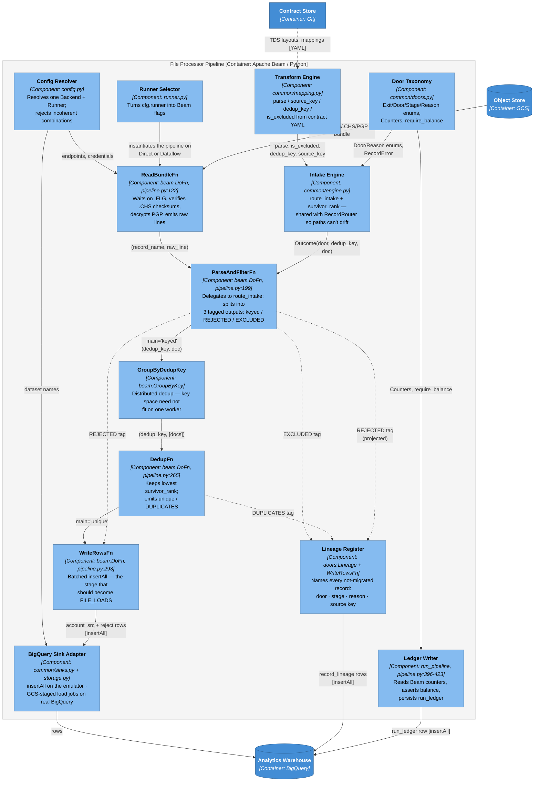
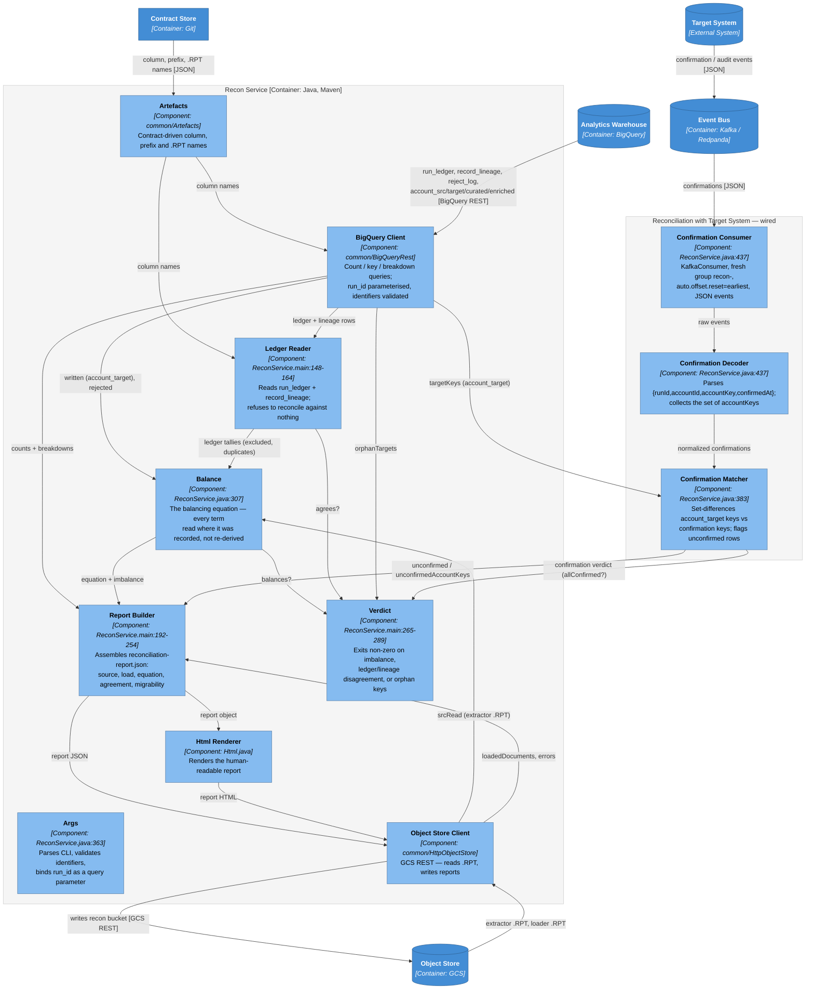
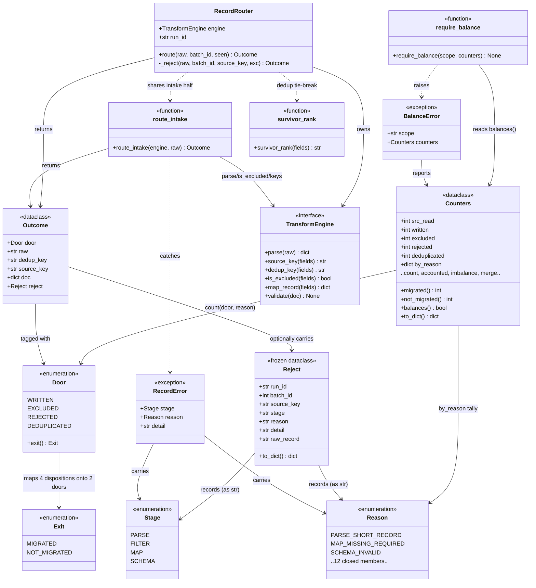

# Architecture Review — `test-gcp-dataflow-dataform-cloud-composer`

Review of the repo's architecture as it stands in the current (post-Gradle-removal) code,
with concrete improvement proposals. This is analysis only — no code was changed.

## What the architecture is

A mainframe→Target-System migration prototype organized around one claim — **extend, never
rewrite** — backed by a contract layer and a correctness engine:

- **`contracts/`** is the only thing you touch to add a migration project: TDS layouts
  (pipe-delimited CSV), YAML mappings, JSON Schemas, reference data. `make verify-project2`
  proves a *different* project runs end-to-end with zero changes to `pipelines/` or `apps/`.
- **The two-door engine** (`pipelines/common/engine.py`, `doors.py`):
  `parse → filter → dedup → map → schema`, with the balancing equation
  `src_read == migrated + not_migrated`, always recorded with the disposition breakdown
  (`written + excluded + rejected + duplicates`). `route_intake` (parse + filter) is
  shared between the Beam path and the in-memory router so those can't drift;
  `survivor_rank` is the single content-based tie-break so replays are stable.
- **Three Beam pipelines** (file_processor, data_enrichment, json_producer) run on
  DirectRunner locally and DataflowRunner on GCP, selected by `runner.py`.
- **Java apps** (extractor, loader, recon, target-system-mock) share `apps/common` for the artefact
  contract and the GCS/BQ REST clients.
- **Artefact contract**: `.FLG` semaphore (written last, outside the PGP bundle), `.CHS`
  checksums, `.ERR`, `.RPT` — same five types on both outer lanes.
- **Local/GCP seam**: `config.py` resolves endpoints/credentials; `storage.py`/`sinks.py`/
  `runner.py` are the adapters; the DAG is GCP-only.
- **Terraform**: 11 modules, one `dev` env.

## Genuine strengths

- The contract layer is the best part — config-driven migration with a fingerprint *proof*
  of extensibility is rare and well-executed.
- `run_ledger` (`file_processor.py:402-423`) persists the door tallies so reconciliation reads
  *observations* rather than re-deriving them.
- The honest comments are a strength: every limitation (insertAll not swapped, emulator
  500-on-duplicate, RecordRouter vs Beam survivor divergence) is documented in-place. The
  code tells you what it doesn't do.
- `survivor_rank` being content-based and shared is the right call for replay-stability.

## Architectural weaknesses, ranked

### 1. Contract duplication across Python and Java with no shared IDL — the biggest structural risk ⚠️ *naming half done*

The artefact naming convention is literally duplicated, with the code admitting it:
`file_processor/pipeline.py:84-92` (`_artefact_names`, comment: *"Mirror of apps/common
Artefacts.java — one naming convention, two languages"*) vs `apps/common/.../Artefacts.java`.
The reject taxonomy (`Stage`/`Reason` enums in `doors.py`) is Python-only. The BQ column names
(`_run_id`, `_dedup_key`, `_batch_id`, `run_id`, `dedup_key`) are agreed *by convention*
across Python writers and Java readers. No codegen, no shared schema.

**Risk:** a rename in Python is invisible to Java until a run fails at integration. The
fingerprint test (`verify_project2.sh`) fingerprints `pipelines/` + `apps/` *together* but
only exercises the Python engine, so it can't catch a Python/Java contract drift.

**Partly implemented.** `contracts/artefacts.json` is now the single source for the artefact
naming convention *and* the shared BigQuery column names. `pipelines/common/artefacts.py`
reads it at runtime; `Artefacts.java` loads it from the classpath, where Maven puts it by
pointing a `<resource>` directory straight at `contracts/` — so there is one file in the
repo and `mvn package` cannot embed a stale variant. `ReconService` now builds its SQL from
`Artefacts.column("src", "dedup_key")` rather than spelling `_dedup_key`, which is what
makes the columns half load-bearing rather than decorative. Two unit tests guard it: one
asserts the Python names are *derived* from the manifest, the other compares the bytes on
Java's classpath against `contracts/artefacts.json` — a mutation check confirms the second
fails when the manifest changes without a rebuild.

**Still open:** the `Stage`/`Reason` taxonomy remains Python-only. Java reads reject rows
but has no counterpart to the enums, so a new reason code is still a convention rather than
a type on that side. That is the part a shared IDL — or the Java unit tests of #7 — would
close.

**Proposal:** make `contracts/` the single source for the cross-language surface, not just
the per-project config. Either (a) generate the artefact-name constants and the BQ column
names from one JSON manifest both sides read at startup, or (b) add a cross-language
contract test: Python writes an artefact, Java reads it and asserts the names/counts; Java
writes, Python reads. Cheapest first step: a tiny `contracts/artefacts.json`
(`{"flg":"{record}.FLG", "chs":"{record}.CHS", ...}`) that both `_artefact_names` and
`Artefacts.java` load, so the "mirror" comment stops being a load-bearing promise.

### 2. Three independent "which world am I in" switches that can disagree

`TARGET_PROFILE` (`config.py:97`), `BQ_TARGET` (`config.py:103`), and `MIG_RUNNER`
(`runner.py:61`) are three separate knobs. `TARGET_PROFILE=real` + `BQ_TARGET=emulator` +
`MIG_RUNNER=direct` is a configuration the code *permits* but which means "real GCS, emulator
BQ, local Beam runner" — incoherent, and nothing fails fast.

**Proposal:** one `Backend` selection with three *derived* properties, not three free
variables. A frozen `Backend` enum (`LOCAL`, `GCP`) resolved once in `Config`, with
`is_local`/`bq_is_emulator`/`runner` derived from it and validated to be consistent. Then a
misconfiguration is a startup error, not a silent wrong-endpoint run.

**Implemented, with one correction to the proposal.** `Backend` and `Runner` are enums
resolved once in `Config`, and `runner.py` now asks `cfg.runner` instead of reading
`MIG_RUNNER` itself — the two components that never consulted each other now share one
answer. But *deriving everything* from the backend would have broken two combinations that
are deliberate, not accidental:

- **LOCAL + `BQ_TARGET=real`** — the free BigQuery sandbox, which is how Dataform is
  exercised against real BQ at zero cost.
- **GCP + `MIG_RUNNER=direct`** — `make smoke-gcp` runs the pipelines in-process against
  real GCS/BigQuery; a smoke test has no business starting a Dataflow job.

So `Config.validate` rejects the two combinations that cannot mean anything — real object
store with an emulator warehouse, and local emulators with Dataflow workers that cannot
reach `localhost` — and leaves the deliberate ones alone. The lesson is that "three
switches" was not simply redundancy: two of the three combinations encode real workflows,
and collapsing them mechanically would have removed capability rather than confusion.

### 3. The one production-critical swap (insertAll → FILE_LOADS) is a TODO sharing a body with the emulator path

`sinks.py:35-65` — `EmulatorBigQueryWriter` and `NativeBigQueryWriter` have *identical*
bodies, kept separate "because they'll diverge"; `storage.py:124-134` (`BigQuery.insert`) is
the shared `insertAll` both delegate to. The divergence point — `WriteToBigQuery` with
FILE_LOADS staged through GCS — is the one change that actually matters at the 20B-row
target, and it isn't implemented. As-is, the "two writers" give the *appearance* of a
backend seam without the substance.

**Proposal:** collapse the two identical writers into one until they truly diverge, *or* —
better — define a `BigQueryWriter` Protocol and force the GCP implementation to exist as a
separate, tested class that uses FILE_LOADS, so the GCP path is real code with its own test,
not a TODO that inherits the emulator body. The honest comment at `storage.py:128` should
stop being a comment and become a branch.

**Implemented — and the weakness was worse than described.** Both writers not only shared a
body, they had **no callers at all**: `WriteRowsFn` called `BigQuery.insert` directly in both
pipelines, so `bigquery_writer` was dead code. The seam existed in the type system and
nowhere on the data path.

`FileLoadsBigQueryWriter` now stages newline-delimited JSON in the Dataflow temp bucket and
issues a load job with `autodetect=False` (a load job that guesses is how a column silently
changes type between runs), and `WriteRowsFn` in both pipelines resolves its writer from
`bigquery_writer` in `setup`. Writes below `min_load_rows` still take `insertAll`: BigQuery
caps load jobs at 1,500 per table per day, which a load job per batch would burn through at
volume, and the run ledger is one row. The threshold is what makes both paths honest rather
than one path pretending.

### 4. Reconciliation re-derives the balancing equation from raw BQ with hand-written SQL

`ReconService.java` runs ~8 `COUNT(*)`/`SELECT` queries to rebuild the equation.

> **Since fixed:** the run id is now bound as `@run_id` (`String q = "@run_id"`) rather than
> interpolated, and `BigQueryRest` throws on `jobComplete:false` — H2 and H4 are closed. The
> structural point below is unaffected: the queries still exist, and still re-derive numbers
> the pipeline already wrote down.

But the pipeline *already* writes `run_ledger` with
`src_read, extraction_written, excluded, rejected, duplicates, balanced`
(`file_processor.py:402-423`), and the DAG's `assert_run_balanced`
(`mig_000001_1.py:195`) already reads it with **parameterized** queries.

So the Java recon is *redundant* with the Python gate, and re-implements the equation a
second time in hand-written SQL.

**Proposal:** recon should (a) read the per-stage ledgers the pipeline already wrote,
(b) cross-check them against the extractor's and loader's `.RPT` artefacts (the
upstream-claim check), (c) do the per-record key-level reconciliation (orphan targets — the
one thing aggregate ledgers can't catch), and (d) **not** re-run `COUNT(*)` with interpolated
SQL. This eliminates H2 and H4 at the architecture level — by removing the hand-written SQL
entirely rather than parameterizing it — and shrinks recon to "ledger agreement +
key-level orphans + report rendering."

**Implemented, and it found something the proposal did not anticipate.** Recon now reads the
ledger row **once** instead of a query per column, and takes `excluded`/`duplicates` from it
— those are observations the pipeline recorded, and no row survives either door to re-count.
What it does *not* do is drop the other counts: `written` from `account_target` and
`rejected` from `reject_log` count things the ledger does not (the ledger's tallies stop at
the file processor, while map/schema dispositions are settled downstream), and `src_read`
still comes from the extractor's `.RPT` so a discrepancy in our own lane cannot be defined
away.

The real gain is the check that became possible once #5 existed: recon compares the
aggregate ledger against the per-record register door-for-door and **fails the run if they
disagree**, rather than picking a side. A verified mutation — deleting one lineage row —
produces *"the ledger and the per-record register disagree — excluded 100 vs 99 … 'which
records did not migrate' has two answers."*

### 5. No per-record lineage — the balancing equation is an aggregate assertion only ✅ *done*

`file_processor.py:399-401` notes excluded and deduplicated records "leave no row behind, so
they are unrecoverable after the fact." In fact the pipeline computes their source keys —
`ParseAndFilterFn` emits `EXCLUDED` tagged output (`pipeline.py:248`), `DedupFn` emits
`DUPLICATES` tagged output (`pipeline.py:284`) — but **neither tagged output is wired to
anything**; only the counters survive into `run_ledger`. For a migration whose whole point
is verifiable correctness, "we excluded 100 records" is much weaker than "here are the 100,
with source_key and reason."

**Proposal:** a `record_lineage` table (`run_id, dedup_key, door, stage, reason,
source_key, ts`) written at each door. The tagged outputs already exist; they just need a
sink. This turns recon into a JOIN, gives auditors per-record provenance, and makes "why was
this account not migrated" answerable instead of countable. Highest value-to-effort addition
for a migration prototype.

**Implemented.** `bq_recon.record_lineage` is written by *both* stages that settle a
disposition — the file processor (filter, dedup, parse rejects) and the JSON producer
(map, schema rejects) — because the lane's equation closes across the two, not inside one.
Three details the implementation forced, none of them visible from the proposal:

- **The reason taxonomy had to widen.** `Reason` was a *reject* enum; excluded and
  deduplicated records are equally not-migrated and are owed the same enumerated answer, so
  it gained `FILTER_EXCLUDED_BY_CONTRACT` and `DEDUP_LOST_SURVIVOR_RANK`, and `Stage` gained
  `DEDUP`. One closed enum across all three dispositions is what lets the register be read
  with a single `GROUP BY reason`.
- **A parse reject has no source key** — it never reached the field that identifies it. Those
  rows are named by `content_name()`, a stable hash of the raw record, so the register never
  contains a row that names nothing and the row still joins to `reject_log.raw_record`.
- **Migrated records are deliberately not restated.** They are already named in `account_src`
  by `_source_key`/`_dedup_key`; duplicating 1.7M rows would cost storage and prove nothing.
  The two sets together are exactly `src_read`, which is what the equation asserts.

Guarded by acceptance criterion 7, which asserts the register agrees with `run_ledger`
door-for-door and that no row carries a blank key or reason — a lineage table that disagreed
with the ledger would be worse than none, because two answers to "which records did not
migrate" would coexist.

### 6. Terraform: production-critical inputs are optional, so omissions fail at runtime not plan

H7 (Dataform `git_token_secret_version` never passed in `dev/main.tf`) and H8
(`KAFKA_BOOTSTRAP_SERVERS` missing from `env_file`) are symptoms: the modules have defaults
/ the env passes a subset, and Terraform doesn't fail.

**Proposal:** mark production-critical module inputs `required` (no default) —
`git_token_secret_version`, `kafka_bootstrap`, the Dataflow subnet/SA — so a forgotten
input fails at `terraform plan`, not when a job hangs in production. Add a `stage` env so
promotion is real, not just `dev`.

**Implemented differently, because "make them required" would have been wrong.** H7 and H8
are already closed (both inputs are passed, `KAFKA_BOOTSTRAP` is in `env_file`), and an
*empty* `git_remote_url` is a legitimate state — the unlinked-repository path is the only
one exercised. Making it required would break the working configuration to satisfy a rule.

What was genuinely missing was the *coupling*: a linked repository with no token
authenticates as nobody and fails at run time with "the git reference could not be
resolved", which reads like a branch problem and is not one. That pair is now a plan-time
`check` block. Separately, `env_file` emits `DATAFLOW_SUBNETWORK` and
`DATAFLOW_SERVICE_ACCOUNT` from the real module outputs instead of leaving `runner.py` to
guess `mig-subnet` and `dataflow-worker@<project>` — the convention is right on this
environment and wrong on any other, and the failure mode is the expensive one: a job that
starts against a nonexistent subnet and never progresses.

**Still open:** the `stage` environment. Creating one without a second GCP project to apply
it against would be unverified scaffolding, which is the opposite of what this repo is for.

### 7. The Java side has no unit tests; the fingerprint test is Python-only

`mvn -B test` runs no Java tests. The Java apps — loader, recon, target-system-mock, extractor —
are covered only by the Python acceptance tests through the full stack. A Java-side
regression (e.g. `Artefacts.java` renames `.FLG`) is caught only at E2E, if at all.

**Proposal:** a small Java unit-test module that consumes the same contract fixtures
Python produces (the cross-language test from weakness #1 doubles as this). Even a handful
of `ArtefactsTest`/`ChecksumsTest` cases would catch the drift class that the fingerprint
test structurally can't.

**Implemented.** Nine tests in `apps/common/src/test/java` — JUnit 5 was already inherited
by every module, so the wiring existed and only the tests were missing. `ArtefactsTest`
reads `contracts/artefacts.json` off disk as its oracle and asserts every name is *derived*
from it (a mutation reintroducing a hardcoded `.CHECKSUM` fails it); `ChecksumsTest` covers
what a real extract will produce and a synthetic one never does — a final line without a
newline, a tampered payload, a manifest entry with no file, a file nobody listed.

### 8. Defense-in-depth: the loader/target system trusts the schema door

Per correction #2: the schema guarantees `dedupKey` non-empty, so the loader's `asText("")`
+ target system's `putIfAbsent("")` is unreachable in the normal flow. But if any schema bypass ever
exists (a hand-edited JSON, a future producer that skips validation), records silently
collide on `""`. Low priority, but: the target system should reject an empty `X-Idempotency-Key` for
the same reason and with the same mechanism it rejects a missing `accountId`
(`TargetSystemMock.java:122-126`, where a blank `accountId` returns 422) — fail loudly, don't
silently merge. The collision point is the `idempotency.putIfAbsent` at
`TargetSystemMock.java:129`.

**Implemented.** A blank `X-Idempotency-Key` now returns 422, by the same mechanism and for
the same reason as the blank `accountId` above it — so the defence no longer depends on an
upstream door staying shut.

## Prioritized roadmap

| Priority | Change | Why | Effort |
|---|---|---|---|
| ~~**1**~~ ✅ | ~~Wire the `EXCLUDED`/`DUPLICATES` tagged outputs into a `record_lineage` table (#5)~~ **done** | Turned aggregate correctness into per-record auditability — guarded by acceptance criterion 7 | S |
| ~~**2**~~ ✅ | ~~Recon reads `run_ledger` + `.RPT`~~ **done** — one ledger read, plus a ledger-vs-register agreement check that fails the run | The counts that remain are of things the ledger does not cover | M |
| ~~**3**~~ ✅ | ~~Shared contract manifest for artefact names + BQ columns, loaded by both languages (#1)~~ **done** — `contracts/artefacts.json`; the reject taxonomy half of #1 remains | Removed the naming drift risk; unblocks #7 | S |
| ~~**4**~~ ✅ | ~~One `Backend` selection in `Config`~~ **done** — incoherent combinations rejected by `Config.validate`; two deliberate ones kept | Makes a misconfiguration a startup error | S |
| ~~**5**~~ ⚠️ | ~~Terraform inputs~~ — `check` block on the Dataform credential pair + real Dataflow subnet/SA in `env_file`. **`stage` env still open** | A linked repo with no token now fails at plan | S |
| ~~**6**~~ ✅ | ~~Real file-loads writer behind the `BigQueryWriter` Protocol (#3)~~ **done** — and wired onto the data path, which it never was | The one change that matters at volume | M |
| ~~**7**~~ ✅ | ~~Java unit tests consuming shared contract fixtures (#7)~~ **done** — 9 tests, mutation-checked | Catches Java-side regressions before E2E | M |
| ~~**8**~~ ✅ | ~~Target System rejects empty idempotency key (#8)~~ **done** | Defense-in-depth, symmetric with the accountId check | XS |

The roadmap above is about the *architecture of the code*. The separate question — what has to
be true before this runs the real migration (volume, real contracts, security, CI, cutover) — is
[`docs/production-readiness.md`](docs/production-readiness.md).

## Review findings addressed 2026-08-19

A separate review of the post-implementation code raised six findings; all six were
verified against the code and stand. Five were fixed and one is a repository-hygiene item:

| # | Finding | Resolution |
|---|---|---|
| 1 | `run_ledger.target_written` held the *extraction* count under a TARGET-stage name — the 08-18 evidence shows the ledger reading 42 beside a recon report reading 40 for the same run, both correct at different stages | Column renamed **`extraction_written`** across the pipeline, the DAG gate, recon, Terraform and `init_infra`; live tables migrated with `ALTER TABLE … RENAME COLUMN` |
| 2 | The Python pipelines interpolated `run_id` into SQL while Java had closed the same hole | **Mitigated, not closed.** `config.require_identifier` mirrors Java's `SAFE_IDENTIFIER` and now guards every entry point — the three pipeline mains, the orchestrator, and `tests.acceptance` where the run id comes from a state file. The SQL still interpolates: BigQuery cannot bind identifiers, and several statements name their table that way too. Java remains the stronger side, binding `@run_id` as a parameter |
| 3 | The per-batch `require_balance` in `json_producer` balanced by construction and could never fail | Replaced with a check that can: every non-final batch must hold exactly `batch_size` documents |
| 4 | `json_producer` appended to `reject_log` and `record_lineage` without purging them, so a standalone re-run double-counted | Purge added, scoped to `stage IN ('map','schema')` so it removes only what this stage writes. *The review's stated symptom was wrong*: both sides of the agreement check double equally, so `ledgerAgreement.agrees` stays true — what actually breaks is the balancing equation |
| 5 | `WriteRowsFn`'s docstring still said FILE_LOADS "is not written — do not read this class as if it were", after the writer had been wired | Docstring rewritten to point at `bigquery_writer(cfg)` as the selection seam |
| 6 | Several referenced files were untracked | Staged. The review under-rated this: `pipelines/common/artefacts.py` is imported by tracked code, so a fresh clone failed at import, not merely at a broken link |

## Second review pass, 2026-08-19

A follow-up review raised ten findings. Eight were confirmed, one was already done, and one
was half-right:

| # | Finding | Resolution |
|---|---|---|
| 1 | The project id is hardcoded in 29 tracked files, against the README's own rule | **Open** — needs a decision: `-backend-config` for the state bucket, blank `project_id`/`region` defaults, and either gitignoring `docs/evidence/` or redacting it |
| 2 | `run_pipeline.py --profile` rebuilt `Config` directly and skipped `validate()` | Fixed: `replace(cfg, profile=…).validate()`. The bypass let through exactly the real-GCS-plus-emulator-warehouse pairing the guard exists to reject |
| 3 | `run_id` interpolation mitigated, not closed | `tests.acceptance` now guards the run id it reads from `local/state/last_run_id`, closing the last unguarded path; the doc claim above is corrected to say *mitigated* |
| 4 | DAG comment said the Java apps "only work against the emulators" | Deleted — `GcpToken` mints a metadata-server token, and both tasks ran against real GCP on 08-18 |
| 5 | `loader-app` / `recon-service` had tailored roles no pod ever used | Per-app Kubernetes SAs (`mig-loader`, `mig-recon`) annotated to those accounts; the DAG selects them per task, so recon now runs read-only as intended |
| 6 | `BigQueryRest` ignored `pageToken` | Paginates. Aggregates were safe; the first per-key query would have reconciled against a fraction of the data and reported agreement |
| 7 | `contracts/README.md` overstated what the fingerprint proves | Rewritten: `git diff --quiet` is the real assertion, the hash compares the tree with itself |
| 8 | `make verify` never checked the delta run | New criterion 10 — the delta balances *and* none of its keys carry the initial run id |
| 9 | Check 5 was named `kafka_batches` but mostly asserts GCS batches | Renamed; the Kafka half is stated as conditional |
| 10 | "The BigQuery column rename is unfinished" | Already done — but the README headline still said "42 migrated" where lane-wide was 40, the very confusion the rename removed. Fixed |

## The thread

The thread running through #1, #3, #4, #5, #7 is the same: the repo's central insight —
*the contract is the system* — is currently enforced *within* Python but only *by
convention* across the Python/Java boundary and across the local/GCP boundary. Those seams
are the load-bearing parts of the architecture, and right now they're held together by
comments and env-var defaults rather than by types or tests. Making the seams structural (a
shared manifest, a `Backend` enum, a `Protocol` with a real GCP impl, required Terraform
vars) is where the architectural leverage is.

---

# C4 views (Simon Brown's C4 model)

All four levels of the C4 model, zooming in one level at a time. **C1 and C2 are drawn in
the deck** ([README.md](README.md)); C3 and C4 are drawn here, where they belong with the
analysis.

| Level | Scope | What it answers | Drawn in |
|---|---|---|---|
| **C1 — System Context** | The platform as one box | Who uses it, what it talks to | [README.md slide 3](README.md#slide-3--c1-system-context) |
| **C2 — Containers** | Inside the platform | The separately deployable/runnable units | [README.md slide 4](README.md#slide-4--c2-containers) |
| **C3 — Components** | Inside the File Processor Pipeline; inside the Recon Service | The two-door engine's parts; the recon service's parts and the not-yet-wired Target System confirmation edge | below |
| **C4 — Code** | Inside the engine's core | The classes/functions implementing the balancing equation | below |

C1 is also the **specification**: the platform stays GCP, but the runtime inside the boundary is
one implementation choice — Beam on Dataflow today.

C3 zooms into the **File Processor Pipeline** container specifically, because that is the
one container that *produces* the balancing equation the whole system exists to prove —
every other container consumes or transports its result. A second C3 zooms into the **Recon
Service**, the container that *evaluates* that equation and that carries the not-yet-wired
reconciliation-with-Target-System edge (Slide 7). C4 zooms into the engine core inside the File
Processor. Per Simon Brown's own guidance, C4 is drawn sparingly and only where the code
structure carries architectural weight; here it does, because weaknesses **#1** and **#5**
are both visible as concrete code-level facts.

Notation: `Component` boxes below, `Person` / `Software System` / `Container` /
`External System` in the deck, with every relationship labelled *what flows* and *over what
protocol/technology*.

## C1 — System Context, and C2 — Containers

Both live in the deck, so the presentation and the analysis do not draw the same picture twice:
**[README.md slide 3 (C1)](README.md#slide-3--c1-system-context)** and
**[slide 4 (C2)](README.md#slide-4--c2-containers)**.

What those two levels contribute to the analysis, in one line each:

- **C1** makes the Auditor a first-class actor with a read-only relationship to evidence
  (`run_ledger`, `.RPT`, recon report) — which is precisely the relationship weakness **#5**
  degrades: today that actor can read counts, not records.
- **C2** draws four weaknesses as *relationships* rather than components: **#1** was the dotted
  "by convention only" contract arrow to the Extractor — now a real read of
  `contracts/artefacts.json` on both sides, so that arrow is solid for naming and dotted only
  for the reject taxonomy; **#4** is the two arrows carrying the
  same fact into BigQuery (`run_ledger` written once, `COUNT(*)` re-deriving it); **#5** is the
  arrows that are *missing*, because the `EXCLUDED`/`DUPLICATES` tagged outputs have no sink;
  **#2** is the Loader fanning out to both Target System and the mock, live edge chosen by three
  independent env switches; **#3** is the single `insertAll` write path into the warehouse,
  where `sinks.py:35-65` presents two classes but one container-level edge.

Both C1 and C2 now also carry the **reconciliation-with-Target-System return edge** — now wired:
Target System publishes confirmation/audit events (JSON or protobuf) back over Kafka, and the
Recon Service consumes them to match against `account_target` by `account_key`. A TARGET row
with no matching confirmation fails the run (README Slide 7). This is the production
reconciliation edge beyond the prototype's internal balancing equation — not a weakness, so it
is not ranked above, but it is the edge that closes the loop the Auditor ultimately needs, and
it is now implemented ([`docs/PLAN-CHANGES-22082026.md`](docs/PLAN-CHANGES-22082026.md)).

**C1 constrains the boundary, not the runtime inside it.** Per README.md:107-110, *"C1 is the
specification, not a picture of this repo — the platform is GCP and stays GCP; what varies is
the runtime inside the boundary."* Everything analysed above describes the runtime this repo
actually ships (Beam Python on Dataflow, Composer, Dataform). For the worked-out alternatives
that satisfy the same C1 — Spark/Dataproc, dbt+BigQuery, Cloud Run+Workflows, and a
streaming/CDC variant that modifies one input edge — see
[`docs/alternative-implementations.md`](docs/alternative-implementations.md). Those are
unapproved proposals, not descriptions of this system; nothing there is in the build or the
acceptance suite.

## C3 — Components (File Processor Pipeline)

Zooming into the **File Processor Pipeline** container — `pipelines/file_processor` plus the
shared `pipelines/common` modules it composes. This is where the two-door engine lives and
where `run_ledger` is produced.

Solid boxes are components; the Beam `DoFn`s are the pipeline's own, the `common` modules are
shared components it depends on. Dashed edges are Beam *tagged outputs* — all three of which
are now consumed; until weakness #5 was implemented, two of them ended in dead-ends.



### Component responsibilities

| Component | Source | Responsibility |
|---|---|---|
| Runner Selector | `common/runner.py` | Turns `cfg.runner` into Beam flags |
| Config Resolver | `common/config.py` | One `Backend` + `Runner`, validated at startup |
| ReadBundleFn | `file_processor/pipeline.py:122` | `.FLG` wait, `.CHS` verify, PGP decrypt, emit raw lines |
| ParseAndFilterFn | `file_processor/pipeline.py:199` | Intake door; 3-way tagged split |
| GroupByDedupKey | `pipeline.py:377` | Distributed dedup grouping |
| DedupFn | `file_processor/pipeline.py:265` | `survivor_rank` tie-break; unique vs duplicates |
| WriteRowsFn | `file_processor/pipeline.py:293` | Batched `insertAll` of src + reject rows |
| Intake Engine | `common/engine.py:46,100` | `route_intake`, `survivor_rank` — the shared half |
| Door Taxonomy | `common/doors.py` | `Exit`/`Door`/`Stage`/`Reason`, `Counters`, `require_balance` |
| Transform Engine | `common/mapping.py` | Contract-driven parse/key/exclude predicates |
| Ledger Writer | `pipeline.py:396-423` | Counter harvest, balance assertion, `run_ledger` persistence |
| Lineage Register | `common/doors.py` (`Lineage`, `content_name`), `pipeline.py` lineage branch | Names every not-migrated record into `record_lineage` |
| BigQuery Sink Adapter | `common/sinks.py`, `storage.py` | `InsertAllBigQueryWriter` (emulator, and small writes) / `FileLoadsBigQueryWriter` (real BigQuery) |

### What the C3 exposes

- **The two red dead-ends this diagram used to show were weakness #5, drawn literally** — the
  `EXCLUDED` and `DUPLICATES` PCollections were computed, tagged, counted and dropped. They now
  flatten into the Lineage Register, and the third disposition (`REJECTED`) is projected onto
  the same shape so the register has one row format across all three doors. The fix was as
  small as the diagram predicted; what it was *not* was confined to this container — the
  map/schema rejects settled by the JSON Producer had to write the same table, which the
  acceptance criterion caught immediately.
- **`Intake Engine` is deliberately smaller than the full router**, and the docstring at
  `engine.py:46-70` explains why: the Beam path stops after parse+filter because dedup is a
  `GroupByKey` rather than an in-memory `seen` set, and map/schema *cannot* run at intake
  (enrichment-only fields like `BRANCH_NAME` aren't present yet, so mapping would reject every
  record with `MAP_MISSING_REQUIRED`). This is the one place the diagram shows a shared
  component that is correctly *partial* rather than incompletely factored.
- `Config Resolver` and `Runner Selector` used to read three env vars and never consult each
  other — weakness **#2** at component granularity; the runner is now resolved by `Config`
  alongside the endpoints, so the arrow between them is a real dependency. The other
  component-level instance of **#1** is gone: `_artefact_names` no longer exists, and
  `common/artefacts.py` reads the manifest from `Contract Store` like every other contract.

## C3 — Components (Recon Service)

The second component view zooms into the **Recon Service** container — `apps/recon-service`,
the Java/Maven jar that *evaluates* the balancing equation the File Processor produces and
renders the reconciliation report. Where the File Processor C3 is about producing the equation,
this one is about closing it.

Solid boxes are components that exist today. The reconciliation-with-Target-System subgraph
is now **implemented** — the dashed `NOTWIRE` box has gone solid. `recon-service/pom.xml`
carries `kafka-clients 3.7.1`, `ReconService.java:437` reads the confirmation topic, `:383`
matches confirmations against `account_target` by `account_key`, and `:332-348` fails the run
on an unconfirmed row. It is drawn here so the link between internal balancing (Slide 6) and
reconciliation *with* Target System (Slide 7) is visible at the component level, not just the
container level.



### Component responsibilities

| Component | Source | Responsibility |
|---|---|---|
| Args | `ReconService.java:363` | CLI parse, identifier validation, `run_id` bound as a query parameter |
| Object Store Client | `common/HttpObjectStore` | GCS REST — reads `.RPT` artefacts, writes reports |
| BigQuery Client | `common/BigQueryRest` | Count / key / breakdown queries; `run_id` parameterised, identifiers validated |
| Artefacts | `common/Artefacts` | Contract-driven column, prefix and `.RPT` names |
| Ledger Reader | `ReconService.main:148-164` | Reads `run_ledger` + `record_lineage`; refuses to reconcile against nothing |
| Balance | `ReconService.java:307` | The balancing equation; every term read where it was recorded, not re-derived |
| Report Builder | `ReconService.main:192-254` | Assembles `reconciliation-report.json` |
| Html Renderer | `Html.java` | Renders the human-readable report |
| Verdict | `ReconService.main:265-289` + `:332-348` | Exits non-zero on imbalance, ledger/lineage disagreement, orphan keys, or an unconfirmed TARGET row |
| Confirmation Consumer | `ReconService.java:437` (`readConfirmations`) | KafkaConsumer with a fresh per-run group `recon-<runId>`, `auto.offset.reset=earliest`, seek-to-beginning + bounded `endOffsets`; reads JSON events `{runId,accountId,accountKey,confirmedAt}` |
| Confirmation Decoder | `ReconService.java:437` (JSON parse, folded into `readConfirmations`) | Parses each record into a confirmation event and collects the set of `accountKey`s |
| Confirmation Matcher | `ReconService.java:383` (`matchConfirmations`) | Set-differences `account_target` keys against confirmation keys; builds the `unconfirmedAccountKeys` list and the `allTargetRowsConfirmed` verdict |

### What this C3 exposes

- **Recon now proves Target System accepted the load, not just that the lane is internally consistent.**
  The balancing equation is still evaluated from the loader's own `.RPT` and `account_target`,
  both inside the platform; Target System's say-so now enters the verdict through a second,
  independent path. The mock publishes one confirmation event per accepted write (HTTP 201) to
  the `target-system-confirmations` topic, keyed by `accountKey`; recon reads the topic with a
  fresh consumer group per run and set-differences the confirmation keys against `account_target`.
  A TARGET row with no matching confirmation fails the run — "sent but not persisted" is now a
  red verdict, not a gap in the diagram (README Slide 7, [docs/PLAN-CHANGES-22082026.md]).
- **The confirmation-topic read is a full scan per run.** `auto.offset.reset=earliest` with a
  fresh `recon-<runId>` group means every confirmation ever published is read end-to-end each
  run. That is fine at prototype volume (hundreds of rows); before real volume it needs a
  bounded/incremental read — seek-by-timestamp to the run's start, or a compacted topic keyed
  by `account_key` with recon reading only the compacted tail. Named in
  [docs/production-readiness.md](docs/production-readiness.md) §2 (Scale), cross-ref §2.1 and §2.4.
- **`Balance` keeps the four-door field names on purpose.** `ReconService.java:294-302` says
  the two-door framing is a presentation layer over `written`/`excluded`/`rejected`/
  `duplicates`, deliberately not a rename, so archived evidence reports stay comparable with
  new ones. This C3 describes the code as it stands; the simplification plan is the bridge
  from these fields to `written`/`rejected` only.

## C4 — Code (the two-door engine core)

The innermost level: the classes and functions in `common/doors.py` and `common/engine.py`
that implement the balancing equation. This is a UML-style class diagram of the code as it
actually exists.



### The balancing equation in code

The correctness contract the whole system exists to prove is four lines of `doors.py`:

```python
# doors.py:145-166
migrated      = written
not_migrated  = excluded + rejected + deduplicated
accounted     = written + excluded + rejected + deduplicated
balances      = (src_read == accounted)
```

`Door.exit` (`doors.py:47-51`) is the type-level statement of the same fact — `WRITTEN` maps
to `Exit.MIGRATED`, every other disposition to `Exit.NOT_MIGRATED`:

```python
@property
def exit(self) -> Exit:
    return Exit.MIGRATED if self is Door.WRITTEN else Exit.NOT_MIGRATED
```

### What the C4 exposes

- **The taxonomy is genuinely well-typed on the Python side.** `Stage` and `Reason` are closed
  enums, `RecordError` carries them structurally so *"the caller never has to interpret a
  message string"* (`doors.py:87-90`), and `Reject` is frozen. This is the strongest code in the
  repo — which is exactly what makes weakness **#1** sting: **none of these types cross into
  Java.** `Reject` declares `stage` and `reason` as plain `str`, populated with
  `exc.stage.value` / `exc.reason.value` (`engine.py:56-57`), so the enums are flattened to bare
  strings *before* they reach storage. The C4 diagram is Python-only not because Java is out of
  scope, but because Java has no counterpart to draw.
- **`Counters.to_dict()` renames fields at the storage boundary** (`doors.py:178-195`, and the
  class docstring admits it): `written` becomes `extraction_written`, `deduplicated` becomes
  `duplicates` in `run_ledger`. Two spellings for two of the five numbers the equation turns on,
  agreed by convention between the Python writer and the Java/SQL readers — a second concrete
  instance of weakness **#1**. The first of those spellings used to be `target_written`, which
  was worse than inconsistent: it named the *extraction* count after the TARGET stage, so a
  ledger reading 42 sat beside a reconciliation report reading 40 for the same run, both
  correct at different stages.
- **`route_intake` and `RecordRouter.route` share only the intake half**, and `survivor_rank` is
  a free function used by both dedup implementations precisely so replays are stable
  (`engine.py:100-111`: *"it must depend only on a record's content, never on arrival order"*).
  The sharing is exactly as wide as it can safely be — which is why "genuine strengths" lists it.
- **`Outcome.reject` and `Outcome.doc` are both optional**, but nothing in the type system ties
  `door == REJECTED` to `reject is not None`. A `Door.REJECTED` outcome with a `None` reject is
  constructible — the one place in this otherwise tight taxonomy where an invariant is upheld by
  convention rather than by the type.
