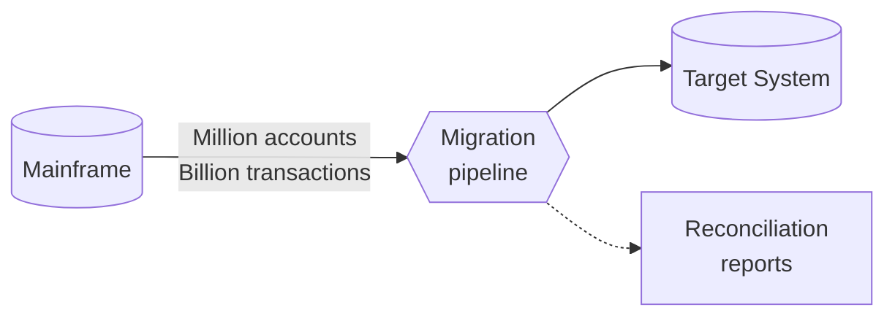
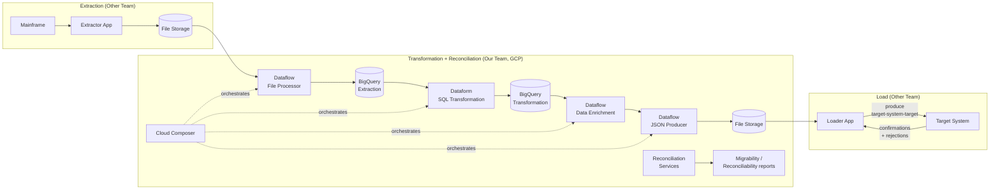
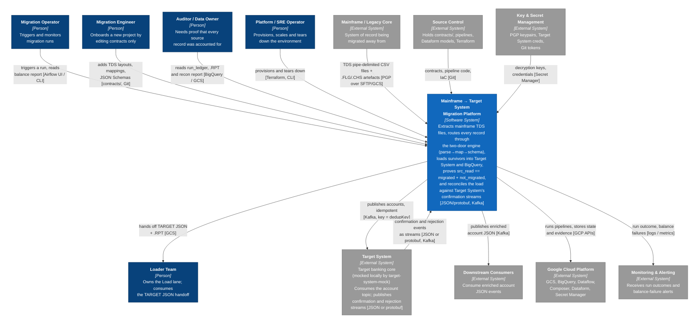
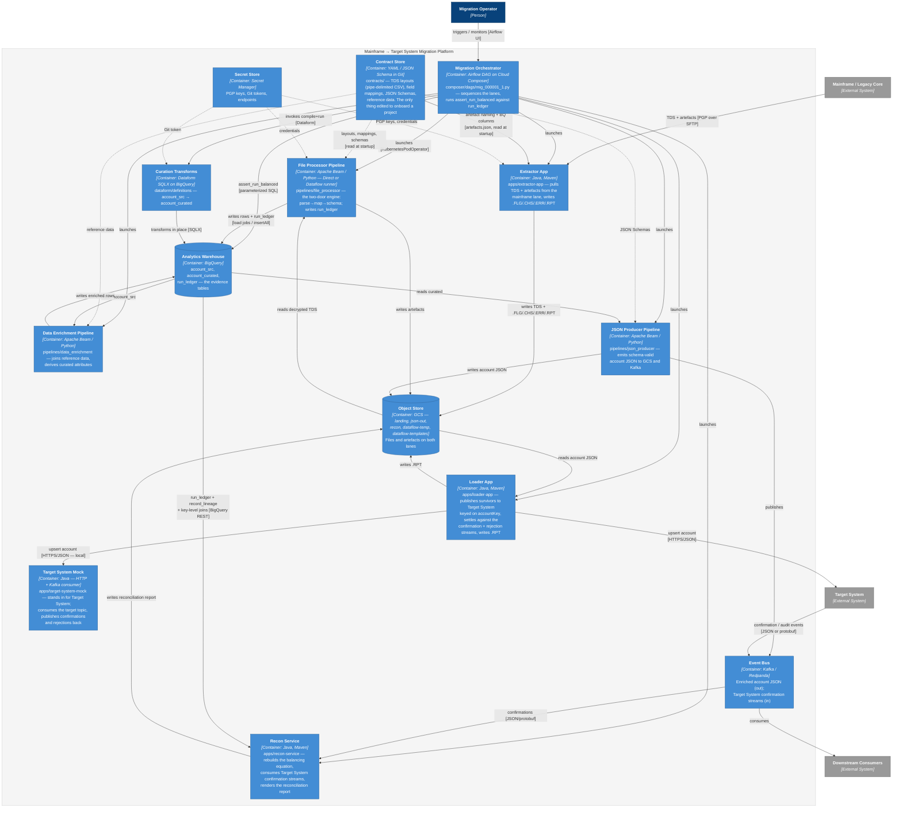
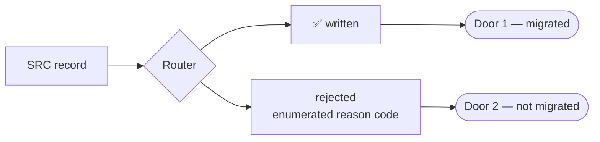
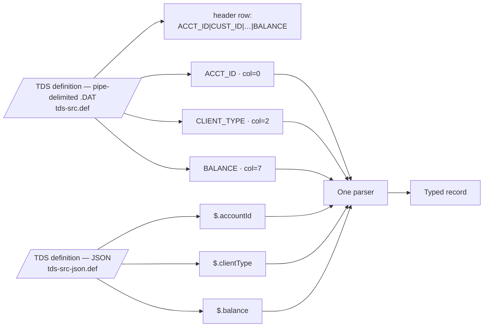
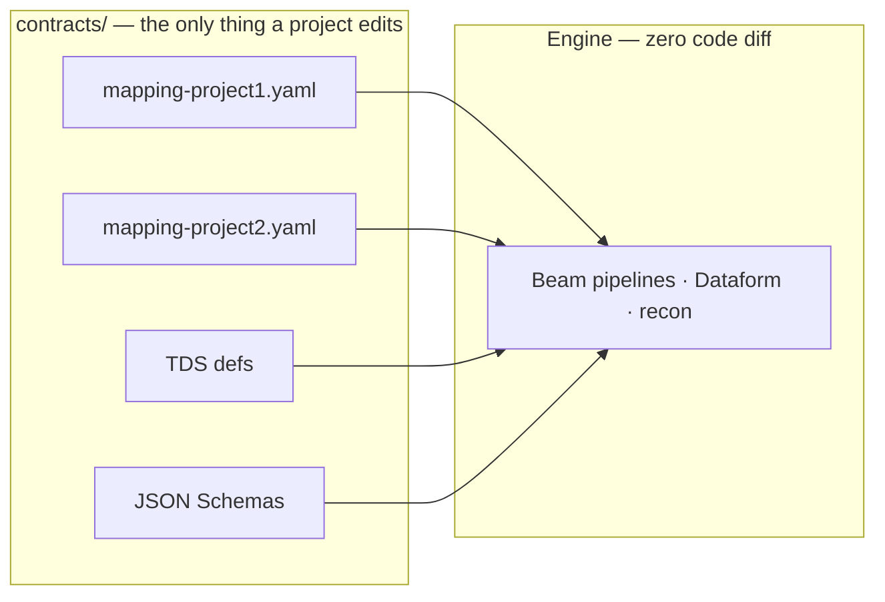
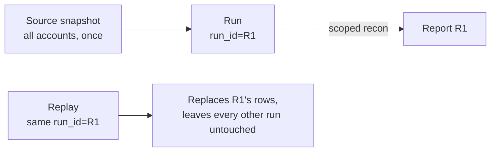
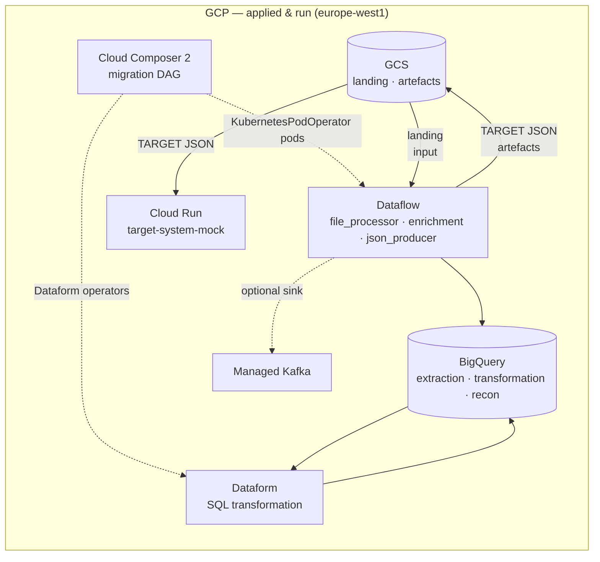

# Mainframe → Target System MVP migration prototype

A working prototype (still WIP) that runs end-to-end against **real GCP provisioned with
Terraform** (Dataflow, BigQuery, Dataform, Cloud Composer).

This README doubles as a presentation — each section is one slide. Operator detail lives in
[`docs/`](docs/); the architecture analysis lives in
[ARCHITECTURE.md](ARCHITECTURE.md).

---

## Slide 1 — The problem

Migrate **n Million accounts / Billions of transactions** from Mainframe Db into **Target System**, verifiably.



- Real data & contracts from the other team land **2 months after our MVP deadline**.
- So: prove **our half** (Transformation + Reconciliation) against synthetic data and mocked
  contracts.

---

## Slide 2 — The pipeline, end to end



Every stage emits artefacts: `.DAT` `.CHS` `.ERR` `.RPT` `.FLG` — checksums and semaphores
so reconciliation never trusts a stage's word for it.

---

## Slide 3 — C1, System Context

C4 notation from here on: `Person`, `Software System`, `Container`, `External System`, every
relationship labelled *what flows* and *over what technology*.



**Reading it.** Five actors, seven external systems. Three points prose does not make:

- **The Auditor is a first-class actor with a read-only relationship to evidence**
  (`run_ledger`, `.RPT`, recon report). That relationship is exactly what weakness #5 in
  [ARCHITECTURE.md](ARCHITECTURE.md) degrades — today the auditor can read
  *counts*, not *which records*.
- **C1 is the specification, not a picture of this repo.** The platform is GCP and stays GCP;
  what varies is the runtime *inside* the boundary. Today that is Beam on Dataflow.
- **Reconciliation with Target System is a return edge — now wired.** Target System publishes
  confirmation/audit events back to the platform as streams (JSON or protobuf, over Kafka),
  consumed to reconcile the load. The prototype wires this today: the mock publishes one
  confirmation per accepted write, recon matches it against `account_target`, and an unconfirmed
  row fails the run (Slide 7).

---

## Slide 4 — C2, Containers

Zooming inside the platform boundary. Each box is a separately deployable/runnable unit.



**Reading it.** Three arrows carry the honest bad news, and each is a known weakness:

- The **dotted `Contract Store → Extractor App` arrow** used to be labelled "by convention
  only" — a comment promising two languages agreed on artefact names. Both now load
  `contracts/artefacts.json`, so that promise is a file; what remains by convention is the
  reject taxonomy, which exists only in Python.
- **Two arrows into BigQuery once carried the same fact** — `File Processor → run_ledger` and
  `BigQuery → Recon Service (COUNT(*))`, the equation written once and re-derived once. Recon
  now reads the ledger and the per-record register and fails the run if they disagree, rather
  than re-deriving a second answer.
- **`Loader App` fans out to both Target System and the mock**, and the Beam pipelines run on
  Direct *or* Dataflow. Which edge is live used to be decided by three independent env
  switches; it is now one resolved `Backend`, and the combinations that cannot mean anything
  are rejected at startup.

Beyond those three weaknesses, C2 also shows the **reconciliation-with-Target-System return
path** — now wired: Target System publishes confirmation/audit events (JSON or protobuf) back
to the Event Bus, and the Recon Service consumes them to match against the load. A TARGET row
with no matching confirmation fails the run (Slide 7, [`docs/PLAN-CHANGES-22082026.md`](docs/PLAN-CHANGES-22082026.md)).

Deeper views — **C3** (components inside the File Processor and the Recon Service) and **C4** (the two-door engine's
types) — are in
[ARCHITECTURE.md](ARCHITECTURE.md#c3--components-file-processor-pipeline).

---

## Slide 5 — What we actually built (every box has a deliverable)

| Element in architecture diagram | Here | Stack |
|---|---|---|
| Mainframe | `harness/` | Python |
| Extractor App *(mock)* | `apps/extractor-app` | Java |
| File Storage | fake-gcs-server → GCS | — |
| Dataflow File Processor | `pipelines/file_processor` | Beam Python |
| BigQuery Extraction / Transformation | `bq_extraction`, `bq_transformation` | BQ |
| Dataform SQL Transformation | `dataform/definitions/*.sqlx` | SQLX |
| Dataflow Data Enrichment | `pipelines/data_enrichment` | Beam Python |
| Dataflow JSON Data Producer | `pipelines/json_producer` | Beam Python |
| Cloud Composer | `composer/dags/` (migration DAG) | Airflow |
| Reconciliation Services | `apps/recon-service` | Java |
| Loader App *(mock)* | `apps/loader-app` | Java |
| Target System *(mock)* | `apps/target-system-mock` | Java |

Mocks honour the stated contracts → the full chain runs **without waiting for real data**.

---

## Slide 6 — Two doors + the balancing equation

Every record leaves through **exactly one door**. Two dispositions, two doors, and the
equation closes per run *and* per batch:



```
src_read     = migrated + not_migrated
migrated     = written
not_migrated = rejected
```

**A run that does not balance fails the DAG.** Proved by `make verify`; persisted per run in
`bq_recon.run_ledger`.

And the rejected door is not only counted — every record that leaves through door 2 is
**named** in `bq_recon.record_lineage` with its source key, door, stage and enumerated reason,
so "why was this account not migrated?" is answerable per record, not just per tally:

```sql
SELECT source_key, door, stage, reason, detail
FROM `<project>.bq_recon.record_lineage`
WHERE run_id = 'initial-…' AND door = 'rejected'
-- ACC000000007 | rejected | parse | PARSE_BAD_NUMERIC | non-numeric BALANCE
```

---

## Slide 7 — Reconciliation with Target System

Slide 6 closes our *internal* books — `src_read = migrated + not_migrated`. Reconciliation
**with Target System** is the layer on top: proving Target System actually accepted and persisted
what the loader handed off. That proof does not come from the loader's HTTP response — it
comes back from Target System as **streams**, which the reconciliation side consumes and matches
against the load.

1. Target System publishes its confirmation/audit events as **streams of data**, in **JSON or
   protobuf** format, on **Kafka topics** — consumed by the reconciliation side and matched
   against what the loader sent.

The prototype now wires this. On every accepted write (HTTP `201 Created`) the Target System
mock publishes a confirmation event `{runId, accountId, accountKey, confirmedAt}` to a second
Kafka topic (`target-system-confirmations`). The recon service reads that topic with a fresh
per-run consumer group (`recon-<runId>`, `auto.offset.reset=earliest`), takes the set of
confirmed `accountKey`s, and set-differences it against the TARGET rows in `account_target`. A
TARGET row whose key has no matching confirmation is **sent but not persisted** — the run fails
with `RECONCILIATION FAILED: target system reconciliation GAP — N of M TARGET rows unconfirmed`
and exits non-zero. A no-Kafka run (no confirmation bootstrap configured) skips cleanly rather
than reading "zero confirmations" as a gap, so `make smoke-gcp --sinks gcs` stays green.

This is acceptance criterion 9 — the only criterion that checks an *external* system's own
claim, not an internal invariant. The negative path is exercised through the mock's
`/__admin/suppress-next-confirmation` one-shot hook, which makes one accepted write publish no
confirmation; recon then names the unconfirmed `account_key` and fails the run. See
[`docs/PLAN-CHANGES-22082026.md`](docs/PLAN-CHANGES-22082026.md) for the build sequence.

> **Scale caveat.** Recon's confirmation-topic read is a full scan per run
> (`auto.offset.reset=earliest`, fresh group every time). Fine at prototype volume (≈500
> rows), this is the same category of "works at prototype scale, named explicitly as not yet
> real-scale-ready" as §2.1 and §2.4 of [`production-readiness.md`](docs/production-readiness.md):
> a bounded/incremental read (seek-by-timestamp to the run's start, or a compacted topic keyed
> by `account_key`) is needed before real volume.

---

## Slide 8 — TDS carries `.DAT` or JSON

Reason: to extend the actual system.



- A definition is **homogeneous**: one flat `.DAT` layout (the source feed is pipe-delimited
  with a header row) *or* JSONPath for nested JSON — one format per definition, never mixed.
- `.DAT` values are **loaded raw and normalized in the transform** — trailing spaces and
  leading zeros are stripped by explicit `transform:` rules in the mapping, not at parse.
  Full physical spec: [`contracts/README.md`](contracts/README.md).
- SRC and TARGET are **separate definitions**; output validated against TARGET JSON Schema.

---

## Slide 9 — Extend, not rewrite

Reason: five more projects to come; a new project should touch **only `contracts/`** (config
files, not code):



Enforced mechanically: `make verify-project2` runs a second, deliberately different project
with a **zero-line engine diff**.

---

## Slide 10 — One full snapshot per run

How the data arrives from source.



- The source delivers **one full snapshot** per run — every account, every time. No
  initial/delta distinction, no from/to window.
- Replays are idempotent by `run_id`: a re-run with the same id **replaces** that run's rows
  (count-then-DELETE per `run_id`) and touches no other run. Restart costs ≤ one run.
- Proved by re-running the same `run_id` and checking the run still balances with no duplicate
  rows.

---

## Slide 11 — Real GCP architecture implemented



- **Applied and run** on a real project in `europe-west1`: full E → T+R → L, most recently
  run `initial-20260818-165241` — 76 records read end-to-end and **40 migrated to Target
  System**, every not-migrated record named in `record_lineage`, the loader accepting all 40
  documents against the Target System stand-in. Earlier evidence in
  [`docs/evidence/gcp-run-20260804/`](docs/evidence/gcp-run-20260804/).
- **The full DAG runs green on Cloud Composer 2.** Run `manual__2026-08-18T21:49:29+00:00`:
  all 8 tasks succeeded — the semaphore sensor, three Beam pipelines as **real Dataflow
  jobs** launched from `KubernetesPodOperator` pods, the Dataform pod, loader, recon, and
  the `assert_run_balanced` gate. `run_ledger` closed at 76 = 42 migrated + 34 not migrated,
  with 36 `record_lineage` rows naming every one (the extra 2 are json_producer's map/schema
  rejects — the equation closes across the lane, not inside one process). Captured in
  [`docs/evidence/gcp-composer-20260818/`](docs/evidence/gcp-composer-20260818/), including
  the three failures that only the DAG path could expose — and re-run green after two review
  passes in [`docs/evidence/gcp-composer-20260819/`](docs/evidence/gcp-composer-20260819/),
  where the loader and recon tasks first ran under their own narrow service accounts.
  The most recent pass,
  [`docs/evidence/gcp-composer-20260820/`](docs/evidence/gcp-composer-20260820/),
  re-ran green on a fresh extract (`initial-20260821-003500`, run
  `manual__2026-08-20T20:33:28+00:00`) and closed the BigQuery streaming-buffer defect:
  `file_processor` now counts before it deletes, so a first run of a brand-new run id no
  longer fails a DML statement that matches zero rows.
  After the two-door simplification (WRITTEN/REJECTED, one snapshot per run) and the
  "Vault Core" → "Target System" rename, the current HEAD was re-verified 2026-08-22 by
  `make smoke-gcp` 8/8 green against real GCS/BigQuery — see
  [`docs/evidence/gcp-smoke-20260822/`](docs/evidence/gcp-smoke-20260822/).
  The newest pass,
  [`docs/evidence/gcp-composer-20260823/`](docs/evidence/gcp-composer-20260823/), is the one
  that proves Slide 7's claim rather than describing it: a full DAG run with Managed Kafka
  enabled, all 8 tasks green, and **criterion 9 closing on live confirmations** — 50 of 50
  TARGET rows corroborated by Target System's own stream, consumed over SASL_SSL/OAUTHBEARER
  from inside the VPC. Getting there cost five fixes that only real GCP could surface; they
  are itemised in that bundle and in `docs/runbook-gcp.md` §B8.
  Earlier evidence in
  [`docs/evidence/gcp-composer-20260805/`](docs/evidence/gcp-composer-20260805/).
- BigQuery sandbox is free and reachable: `BQ_TARGET=real` runs Dataform against real BQ.
- The expensive resources (Composer, Kafka) are behind feature flags, default **off**, and torn
  down between runs — cost and teardown detail in
  [`docs/runbook-gcp.md`](docs/runbook-gcp.md#composer--create-cost-teardown).

---

## Slide 12 — What it proves (acceptance criteria, not demo)

| | Property | Proved by |
|---|---|---|
| 1 | Two doors + balancing equation, per run *and* per batch | `make verify` |
| 2 | TDS carries `.DAT` or JSON (homogeneous definitions) | `make verify` |
| 3 | Extend, not rewrite — zero engine diff for project2 | `make verify-project2` |
| 4 | Idempotent replays by `run_id` (re-run replaces, never duplicates) | re-run same `run_id` → `make verify` |

These are the four **must-proves**. `make verify` checks them through **10 acceptance criteria**
in `tests/acceptance.py`: the balancing equation closes, seeded malformed records carry the
right reason codes, every TARGET document validates against the JSON Schema, TARGET is emitted
in 200-element batches, every key appears exactly once, every rejected record is named in
`record_lineage` and agrees with the ledger, all five artefact types are present in both lanes,
`.CHS` checksums verify on both sides, every TARGET row is confirmed by Target System
(criterion 9 — the Target System confirmation stream [`docs/PLAN-CHANGES-22082026.md`](docs/PLAN-CHANGES-22082026.md)
adds; the only criterion that checks an external system's own claim, not an internal invariant),
and every document the Loader published came back settled — confirmed, duplicate or rejected
(criterion 10, added with the Kafka Load edge in
[`docs/PLAN-CHANGES-02092026-kafka-loader.md`](docs/PLAN-CHANGES-02092026-kafka-loader.md);
a produce ack proves the broker holds the bytes, not that Target System applied them).

---

## Running it

```bash
make bootstrap && make up && make init-infra   # local stack, no GCP account
make java-build && make run-initial
make verify                                    # all 10 criteria must pass
```

`make help` prints the same sequence as its "typical first run" line — if the two ever
disagree, the Makefile is right.

| I want to… | Read |
|---|---|
| Prove it on my laptop, no cloud account | [`docs/runbook-gcp.md` §A](docs/runbook-gcp.md#a-local-stack-no-billing-no-gcp-account) |
| Provision it on GCP with Terraform | [`docs/runbook-gcp.md` §B](docs/runbook-gcp.md#b-real-gcp-with-terraform) |
| Retarget the repo at my own account / laptop | [`docs/setup-gcp.md`](docs/setup-gcp.md) |
| Find the evidence in the GCP console | [`docs/evidence-map.md`](docs/evidence-map.md) |
| Operate Composer / control cost | [`docs/runbook-gcp.md`](docs/runbook-gcp.md#composer--create-cost-teardown) |
| Understand the architecture and its weaknesses | [ARCHITECTURE.md](ARCHITECTURE.md) |
| Know what stands between this and the real migration | [`docs/production-readiness.md`](docs/production-readiness.md) |

This repo is public, so **no account identifier is committed**: project id, region and billing
account are read from your shell, and the service-account key directory is gitignored. If you
find a hardcoded project id anywhere, that is a bug.
