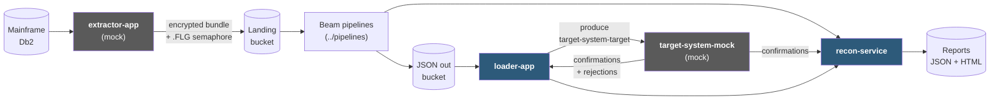
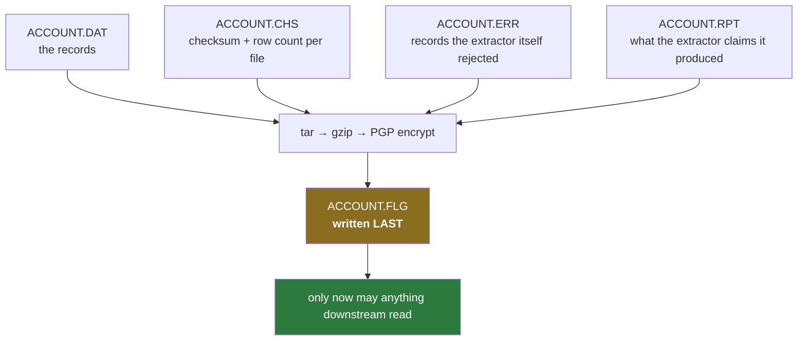
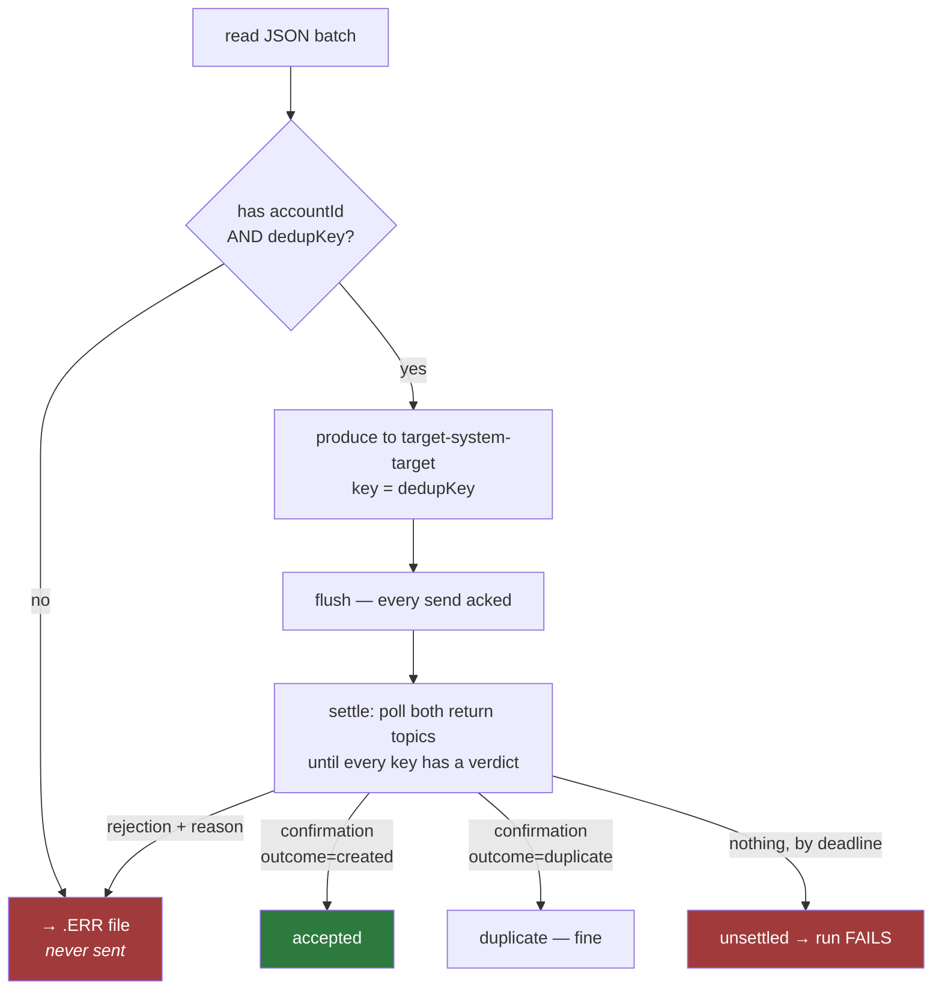

# `apps/` — the five Java applications

**In one sentence:** the parts of the pipeline that are _not_ Beam — the systems at each
end of the chain, plus the two services that check the work.

Two of these stand in for software another team owns (Extractor, Target System); the other
three are ours.

> **Update 2026-08-21.** `run_kind`/`window` are gone from the run context (see
> [`docs/PLAN-CHANGES-21082026.md`](../docs/PLAN-CHANGES-21082026.md) D5) — `RunContext`
> now carries only `runId`. (The loader's `dedupKey`/`X-Idempotency-Key` is a separate,
> retained Target System idempotency concept, not the engine dedup key.)

## What's inside

```
apps/
├── common/           shared library — every other module depends on it
├── extractor-app/    MOCK of the other team's mainframe extractor
├── loader-app/       OURS — pushes documents into Target System
├── recon-service/    OURS — proves the run balanced, writes the reports, cross-checks Target System's own confirmation stream
└── target-system-mock/  MOCK of Target System (the real target); publishes a confirmation event per accepted write
```

Built with Maven: `mvn package`, or `make java-build`. Each produces one self-contained
jar. (Gradle was removed — Maven is the only build.)

## Where each app sits in the chain



Grey = someone else's system, mocked here. Blue = ours.

## The handover contract: five artefacts and a semaphore

The Extractor and the pipeline never call each other. They agree on **files**:



**The `.FLG` semaphore is the whole contract.** It is written last, only once the bundle
is durable. Nothing reads a byte before it appears — which is why a partially-written
extract can never be half-processed.

## `common/` — the shared library

| Class                             | Does                                                                                                                                                            |
| --------------------------------- | --------------------------------------------------------------------------------------------------------------------------------------------------------------- |
| `Artefacts`                       | the naming convention (`.DAT`/`.CHS`/`.ERR`/`.RPT`/`.FLG`) and the shared BigQuery column names — **loaded from `contracts/artefacts.json`**, not declared here |
| `Checksums`                       | write and re-verify SHA-256 + record counts                                                                                                                     |
| `Archives`                        | tar + gzip                                                                                                                                                      |
| `Pgp`                             | encrypt/decrypt the bundle                                                                                                                                      |
| `ObjectStore` / `HttpObjectStore` | GCS access over plain HTTP — no Google SDK. Bucket creation is skipped against real GCS, where buckets are Terraform-owned                                      |
| `BigQueryRest`                    | BigQuery queries over plain REST, binding `@run_id` and following `pageToken`                                                                                   |
| `GcpToken`                        | a Workload Identity token from the GKE metadata server, refreshed — what lets these apps reach real GCS/BigQuery from a pod                                     |
| `RunContext`                      | run id — stamped on everything                                                                                                                                  |

`Artefacts` is the cross-language contract: Maven copies `contracts/artefacts.json` onto this
module's classpath and a `maven-enforcer` rule fails the build without it, so a jar can never
ship with the naming convention missing. `pipelines/common/artefacts.py` reads the same file.
Tests live in `common/src/test/java` — `ArtefactsTest` uses the manifest on disk as its
oracle, so a name hardcoded back into the Java fails the build.

**Why hand-rolled REST instead of the Google SDKs?** These are mock/support apps; pulling
the full Google client tree into them costs more than the ~200 lines it saves. The
`ObjectStore` interface is the seam — swapping in `google-cloud-storage` is a one-class
change if that trade ever stops making sense.

## `loader-app` — the interesting one

Delivering documents to a system that is allowed to be slow, refuse them, or be down is
where "at-least-once delivery" stops being a slogan.

Two sinks, selected with `--sink` (see
[docs/PLAN-CHANGES-02092026-kafka-loader.md](../docs/PLAN-CHANGES-02092026-kafka-loader.md)):
`kafka` is the design, `http` is the original POST path kept runnable for one release so
both can be compared against the same acceptance suite.



**A produce ack is not a verdict.** `acks=all` means the broker durably holds the bytes —
not that Target System parsed, accepted or persisted anything. On the HTTP path the status
code *was* the verdict; here it has to be relocated, not deleted. That is what the settle
phase is: after publishing, read back the confirmation and rejection topics for this run
and derive the tallies from what Target System actually said.

**`unsettled` is the number that matters.** Published, and never spoken about — the failure
mode HTTP could not express, covering a dead consumer and a poison message stalling a
partition. Both otherwise look exactly like a successful run. A non-zero `unsettled` exits
non-zero and fails the DAG.

**Idempotency is real, not hopeful.** `dedupKey` was the `X-Idempotency-Key` header and is
now the message key, so it still both dedupes and — being a hash of the account-key fields
— partitions by account, preserving per-account ordering. A replay is confirmed with
`outcome=duplicate` rather than silently ignored, which is what makes re-running a failed
wave safe instead of reporting it as total loss.

The `accountId`/`dedupKey` check exists because it once didn't: defaulting a missing key
to `""` made every key-less document collide with the first, silently discarding the rest
while reporting success. A blank message key partitions arbitrarily and defeats the dedupe
just as thoroughly, so the check survives the transport change unchanged.

## `recon-service` — the gate

Recomputes the balancing equation from the **upstream's own number** (the extractor's
`.RPT`), not from a figure we derived — so a discrepancy anywhere in our lane shows up as
an imbalance rather than being defined away. Writes `reconciliation.json` and an HTML
report, and **exits non-zero if the equation does not close**, which fails the DAG.

It also cross-checks Target System's own confirmation stream: the mock publishes one
`{runId, accountId, accountKey, confirmedAt}` event per accepted write (HTTP 201) to the
`target-system-confirmations` topic, and recon set-differences those keys against
`account_target`. A TARGET row with no matching confirmation fails the run — "sent but not
persisted" (see [docs/PLAN-CHANGES-22082026.md](../docs/PLAN-CHANGES-22082026.md)). When the
confirmation bootstrap is empty the path skips cleanly, so a no-Kafka run stays green.

## Running them

```bash
make java-build

java -jar apps/loader-app/target/loader-app.jar --run-id my-run
java -jar apps/recon-service/target/recon-service.jar --run-id my-run
```

On real GCP the loader and recon service run as **pods on Composer's GKE cluster** from
images built by `local/scripts/gcp/build_java_images.sh`.

**Local gotcha:** the Target System mock keeps idempotency state until restarted. A run reporting
`accepted=0 duplicates=400` means it remembers the previous run — restart the container, or
`POST /__admin/reset` to clear it. That same `/__admin/reset` also clears the one-shot
`/__admin/suppress-next-confirmation` flag used to exercise the negative path (criterion 9).
