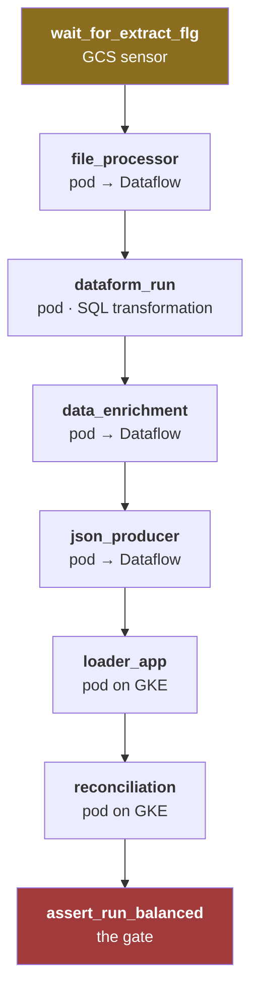
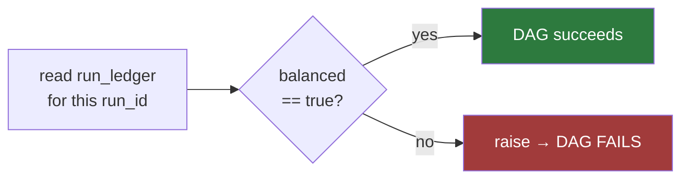

# `composer/` — the Cloud Composer (Airflow) orchestration DAG

**In one sentence:** the single file that says what runs, in what order, and what makes a
migration run fail.

```
composer/
└── dags/
    └── mig_000001_1.py     one DAG, eight tasks
```

`make deploy-dags` uploads this to the Composer environment's DAG bucket.

> **Update 2026-08-21.** Every run is one full snapshot of the source — no initial/delta,
> no window (see [`docs/PLAN-CHANGES-21082026.md`](../docs/PLAN-CHANGES-21082026.md) D5). The
> DAG is parameterised by `run_id` alone; `run_kind`/`window_*` are gone.

## One DAG run = one migration run

The DAG is parameterised, never scheduled. Every run is one full snapshot of the source,
scoped only by `run_id`:

```json
{"run_id": "initial-20260805"}
```

Every task, every BigQuery row and every artefact is stamped with that `run_id`, so a run
can be reconciled, replayed or deleted in isolation.

## The task graph



| Task | Runs as | Why |
|---|---|---|
| `wait_for_extract_flg` | `GCSObjectExistenceSensor` | waits (hours, if needed) for the `.FLG` semaphore, in `reschedule` mode so it frees the worker slot |
| 3 pipelines | `KubernetesPodOperator` | each pod submits its own Dataflow job and blocks on it — a Flex Template launch *stages* rather than runs, so `wait_until_finish()` would have no job to query |
| `dataform_run` | `KubernetesPodOperator` | the Dataform repo is unlinked, so the operators' `git_commitish` cannot resolve; this pod runs `dataform compile --json` + the executor instead |
| `loader_app`, `reconciliation` | `KubernetesPodOperator` | Java, so no Flex Template — pods on Composer's own GKE cluster |
| `assert_run_balanced` | `PythonOperator` | the gate |

**Every task except the sensor and the gate is a pod.** That is the single production path —
see the `beam_pipeline` docstring in the DAG for the full rationale.

## The gate is the point



Without this task, an imbalance is a line in a report nobody reads. With it, *"a run that
doesn't balance is a failed run"* is operationally true. It queries with a bound
parameter, never string interpolation.

## Why the Java lanes are pods

Composer 2 already runs on GKE, so `KubernetesPodOperator` needs **no new
infrastructure** — no Cloud Run service, no extra Terraform module, no new IAM surface.

This used to be broken: the Loader and Reconciliation tasks pointed at
`apps/*/build/install/...` — paths that exist on a developer laptop and never on a
Composer worker. The GCP path could not complete. Fixing it meant publishing the two apps
as images (`build_java_images.sh`) and launching them as pods.

## One production path

This DAG previously had a second `local` mode selected by `MIG_EXECUTION_MODE`, shelling
out to local scripts. That is gone — two implementations of one graph is exactly the
duplication that lets them drift.

**Local testing did not go away.** `make run` runs the same seven stages against
the emulator stack via `local/scripts/run_pipeline.py`. What was removed is the duplicate
*production* code path, not the ability to test cheaply.

> **Known duplication:** `run_pipeline.py` still mirrors this graph task-for-task in
> another language. Collapsing both onto one shared task list is the highest-value cleanup
> left (see `docs/PLAN-CHANGES-21082026.md`, "Out of scope").

## Configuration

Set as environment variables on the Composer environment:

| Variable | Purpose |
|---|---|
| `GCP_PROJECT`, `GCP_REGION` | where everything lives |
| `MIG_JAVA_IMAGE_TAG` | **pin this** to the git SHA `build_java_images.sh` prints |
| `MIG_JAVA_REGISTRY` | Artifact Registry repo holding the pod images |
| `MIG_POD_SERVICE_ACCOUNT` | the KSA most pods run as (default `mig-pipeline` → `dataflow-worker`) |
| `MIG_LOADER_SERVICE_ACCOUNT` / `MIG_RECON_SERVICE_ACCOUNT` | the loader and recon tasks use their own identities (`mig-loader` → `loader-app@`, `mig-recon` → `recon-service@`), so the narrow roles written for those accounts are the ones actually in force |
| `MIG_WORKER_ZONE` | optional — pin Dataflow workers to one zone when regional capacity is short |
| `COMPOSER_KUBERNETES_NAMESPACE` | set by Composer itself; the pods fall back to `default` when absent |
| `BQ_DATASET_*`, `GCS_LANDING_BUCKET` | dataset and bucket names |
| `TARGET_SYSTEM_CONFIRMATION_BOOTSTRAP` | Kafka bootstrap for the confirmation topic; empty ⇒ recon skips the confirmation path (the run stays green without Managed Kafka) |
| `TARGET_SYSTEM_CONFIRMATION_TOPIC` | the topic the mock publishes to on 201 and recon consumes (`target-system-confirmations`) — see [docs/PLAN-CHANGES-22082026.md](../docs/PLAN-CHANGES-22082026.md) |

`MIG_JAVA_IMAGE_TAG` defaults to `latest` so a fresh environment works — but leaving it
there means a rebuild silently changes what an already-deployed DAG runs, and a past run
cannot be reproduced. Pin it, and pin it **the same way in both build scripts**: the DAG
launches the Java *and* Beam images from this one variable, so
`MIG_JAVA_IMAGE_TAG=<tag> bash local/scripts/gcp/build_java_images.sh` and
`MIG_JAVA_IMAGE_TAG=<tag> make build-templates` must agree, or half the images will not
exist under the tag the DAG asks for. All the pod tasks set `image_pull_policy=Always`,
because a `<sha>-dirty` tag is reused by every rebuild from the same tree.

**These variables are Terraform's**, declared in `terraform/modules/composer`. Setting them
with `gcloud composer environments update` works until the next `apply` silently reverts
them — which is how a hand-set target system URL broke the loader three DAG runs later.

## Editing safely

Airflow parses this file on a timer, so a syntax error takes the DAG out of the UI.
Validate before uploading:

```bash
python -c "import ast;ast.parse(open('composer/dags/mig_000001_1.py').read())"
```

Retries are set to 2 with a 2-minute delay: at this scale failure is routine, and
per-batch checkpointing makes a retry cheap. `max_active_runs=1` because concurrent runs
would share BigQuery tables.
