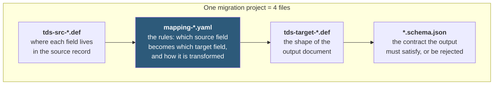
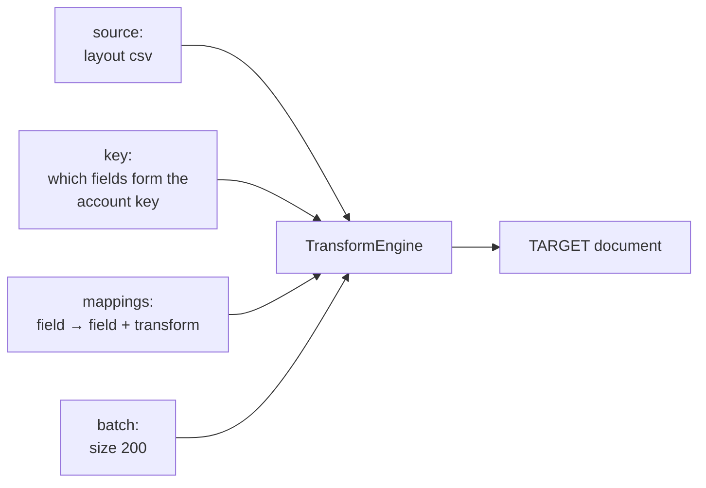
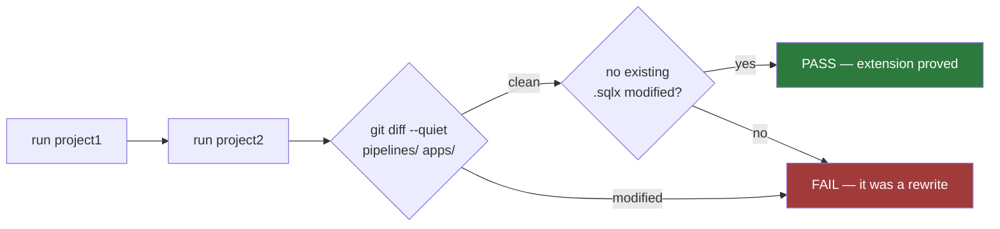

# `contracts/` — the only folder you edit to add a migration project

**In one sentence:** adding a second, completely different migration is supposed to mean
adding files *here* and nowhere else — and a script proves it.

This is the repo's central claim: **extend, never rewrite**. `make verify-project2` runs a
deliberately different project end to end, then fails if a single line of
`pipelines/` or `apps/` changed.

> **Update 2026-08-21.** [`docs/PLAN-CHANGES-21082026.md`](../docs/PLAN-CHANGES-21082026.md)
> D1/D2/D6 has landed: the mapping no longer carries a `filters.exclude` block (removed)
> and the key is the **account key** (was the dedup key, with no survivor-rank tie-break); TDS
> definitions are homogeneous — one format per definition, `.DAT` or JSON, never mixed.
>
> **Update 2026-09-02.** The fixed-width COBOL copybook source layout is gone. Every `.def`
> now declares a single `layout csv delimiter=|` — `contracts/copybooks/` is deleted, and
> `mapping-*.yaml`'s `source.layout` key is `csv` for both projects. The parser in
> `pipelines/common/tds.py` still understands `offset`/`len` addressing for a `fixed`
> layout, since nothing in this repo forces that generality out; no contract declares one.

## What's inside

```
contracts/
├── tds/          record layouts — what a source/target record looks like
│   ├── tds-src-project1.def       ACCOUNT (pipe-delimited CSV)
│   ├── tds-target-project1.def    TARGET_SYSTEM_ACCOUNT
│   ├── tds-src-project2.def       DEPOSIT (pipe-delimited CSV — a different record shape)
│   └── tds-target-project2.def    TARGET_SYSTEM_DEPOSIT
├── mappings/     how a source record becomes a target document
│   ├── mapping-project1.yaml
│   └── mapping-project2.yaml
├── schemas/      the JSON Schema every output document must satisfy
│   ├── target-account.schema.json
│   └── target-deposit.schema.json
├── reference/    lookup data joined during enrichment (branches)
└── artefacts.json  the cross-language surface — artefact naming + shared BQ columns
```

**`artefacts.json` is not per-project.** Everything else here belongs to one migration
project; that file is the contract *between the two languages*, and it is the same for all
projects. `pipelines/common/artefacts.py` reads it at runtime and `apps/common`'s
`Artefacts.java` loads it from the classpath (Maven copies it out of this directory at
build time), so `.FLG`/`.CHS`/`.DAT` naming and the `_run_id` / `_account_key` column names
are declared once instead of once per language. Two unit tests guard it: one asserts the
Python names are derived from the manifest, the other that the copy inside the jar is
byte-identical to this file.

## The four kinds of file, and what each decides



`mapping-*.yaml` is the interesting one — it is the whole transformation, as configuration:



## A worked example

One line from `mapping-project1.yaml`:

```yaml
  - target: status          # the field in the Target System document
    from: STATUS            # the field in the mainframe record
    transform: map_enum     # how to convert it
    values:
      A: ACTIVE
      C: CLOSED
      D: DORMANT
```

A record with `STATUS=A` gets `"status": "ACTIVE"`. A record with `STATUS=X` is
**REJECTED** with reason `MAP_UNMAPPED_ENUM_VALUE` — never silently dropped, never
guessed.

## Source `.DAT` physical format

Every source `.DAT` is **pipe-delimited CSV with a header row** — the fixed-width COBOL
layout it used to carry is gone (see the update note above). Each `.DAT` begins with one
header line of column names; every later line is one record, fields separated by `|`. The
`.def` declares it (`layout csv delimiter=| header=true`) and the header is *skipped, not
parsed*, in the three places that could otherwise mis-count it: `RecordParser.is_header`
in `pipelines/common/tds.py`, `ExtractorApp.java` before `.RPT documentsRead` is written,
and `ReadBundleFn` before a line reaches `src_read`.

The parser still understands `offset`/`len` addressing for a `fixed` layout — nothing in
this repo forces that generality out — but no contract declares one; `col` is what every
`.DAT` field actually uses.

**Load raw, normalize in the transform.** Parse keeps values exactly as they arrive —
trailing spaces and leading zeros are *not* stripped at parse. All normalization is
explicit, in the mapping's `transform:` slot, so what changed about a value is always on the
record. Two transforms in the `TRANSFORMS` registry in `pipelines/common/mapping.py`
cover the stated rules, alongside `trim`, `upper`, `to_decimal`, `map_enum`:

| transform | rule |
|---|---|
| `strip_trailing_spaces` | trailing spaces are stripped in the transform phase |
| `strip_leading_zeros` | leading zeros on numeric fields are stripped in the transform phase |

No current contract needs them — `to_decimal` parses `+00000001234.56` as-is — but a feed
that ships trailing spaces or zero-padding declares the strip in its mapping instead of
getting it silently at parse. These are additions under the Update 2026-08-21 disclaimer
above.

## Why project2 exists

`project2` is not a test fixture — it is the **proof**. It is deliberately unlike project1
in every dimension that could hide a hardcoded assumption:

| | project1 | project2 |
|---|---|---|
| Record | ACCOUNT | DEPOSIT |
| Fields carried | PRODUCT_CODE among others | PRODUCT_CODE dropped entirely |
| Target | TARGET_SYSTEM_ACCOUNT | TARGET_SYSTEM_DEPOSIT |
| Transform | — | uses one project1 never does |



**What actually proves it is `git diff`, not the hash.** The script also fingerprints
`pipelines/` + `apps/` before and after, but that hash compares the *same working tree with
itself* — `project_smoke` only ever reads engine source, so the two hashes are equal by
construction and the check cannot fail. It is a cheap tripwire for a test that writes into
the tree, nothing more. The load-bearing assertion is `git diff --quiet -- pipelines apps`:
no tracked engine file modified, with existing Dataform models checked separately because a
new project may *add* a `.sqlx` but never edit one.

**The one honest caveat:** a new project also adds one new `.sqlx` file in `../dataform`.
SQL shaping a different target table cannot be config-driven without building a SQL
generator, which would be a worse trade. Adding a model is allowed; *editing* an existing
one is not, and the check enforces that difference.

## Adding a third project

1. Write `tds/tds-src-project3.def` and `tds/tds-target-project3.def`.
2. Write `mappings/mapping-project3.yaml`.
3. Write `schemas/target-<thing>.schema.json`.
4. Add one `.sqlx` in `../dataform/definitions/`.
5. Run with `MAPPING=contracts/mappings/mapping-project3.yaml`.

If you found yourself editing anything in `pipelines/` or `apps/`, the engine was missing
a capability — add it *generically*, and `make verify-project2` will tell you: the git check
fails the moment a tracked engine file is modified.
