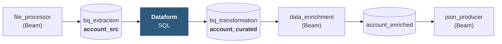
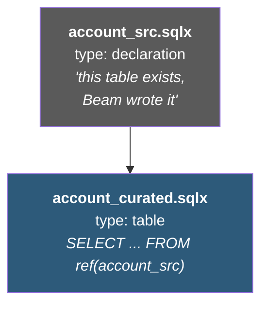
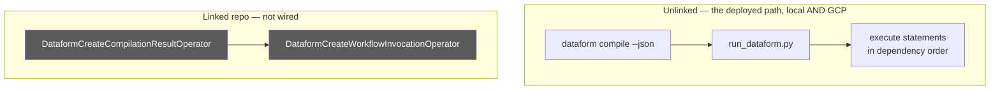

# `dataform/` — the SQL transformation step

**In one sentence:** the part of the pipeline that is SQL rather than Python, sitting
between "records landed in BigQuery" and "records ready to become Target System documents".

```
dataform/
├── workflow_settings.yaml       project + dataset defaults
└── definitions/
    ├── account_src.sqlx         declares the table the file processor wrote
    └── account_curated.sqlx     the transformation itself
```

> **Update 2026-08-21.** There is no run window — each run is one full snapshot, scoped
> by `run_id` (see [`docs/PLAN-CHANGES-21082026.md`](../docs/PLAN-CHANGES-21082026.md) D5).
> The `.sqlx` below scopes to `run_id` only.

## Where it sits



## Why SQL at all, when Beam is already there?

Because this step is **set-based**, and SQL is better at that than a row-by-row pipeline:

- `balance_band` — bucketing every account into HIGH / MEDIUM / LOW / OVERDRAWN
- `account_age_years` — a date difference against the run's snapshot date
- type normalisation before the mapping engine sees the row

Doing this in SQL keeps it declarative and inspectable: an analyst can read
`account_curated.sqlx` and see the business rules without reading Python.

## The two files



A **declaration** tells Dataform about a table it did not create, so `ref()` can point at
it and the dependency graph stays correct. Everything downstream is a real table build.

## Scoped to one run

Every model filters on `run_id`:

```sql
WHERE _run_id = ${dataform.projectConfig.vars.runId}
```

The DAG passes `runId` at compile time, so a run only ever transforms its own rows.
Reruns are idempotent — the same `run_id` rebuilds the same rows.

## The two ways it runs



**Unlinked is the only path exercised — on GCP too, not just locally.** The DAG's
`dataform_run` task is a `KubernetesPodOperator` running `Dockerfile.dataform`, which is the
same `dataform compile --json` + `run_dataform.py` executor, packaged as an image. The
Dataform operators were tried and removed: they require `git_commitish`, which needs the
repository linked to a git remote, and every compile failed with
`400 The git reference 'main' could not be resolved`.

Locally the reason is different — the Dataform CLI cannot point at the BigQuery emulator (no
`apiEndpoint` in `.df-credentials.json`), so the models are compiled offline and the runner
executes the statements against whichever BigQuery endpoint is configured. The `.sqlx`
artefacts stay production-portable either way.

**Linked** requires `dataform_git_remote` + `dataform_git_token_secret_version` in
Terraform. Both empty is a supported configuration, not an omission — but wiring them is
what would let the greyed-out path above replace the pod.

## Gotchas

- **Don't hardcode the project.** Models once did, and executing them against a real
  project failed with `400 project mig-local has not enabled BigQuery`.
- **Dataform CLI 3.x dropped `--repository/--project/--location`** from `compile`. If you
  see "unknown argument", that is the version difference.
- **No partitioning or clustering yet.** Fine on the emulator, a real cost and latency
  problem at scale — `partitionBy` on `run_id` is the obvious first change.

## Adding a model for a new project

A new migration project adds **one new `.sqlx`** here. That is the documented caveat to
"contracts are the only extension point" — SQL that shapes a different target table cannot
be config-driven without building a SQL generator.

Adding a file is allowed. **Editing an existing model is not** — `verify_project2.sh`
fails on it, because that would be a rewrite rather than an extension.
