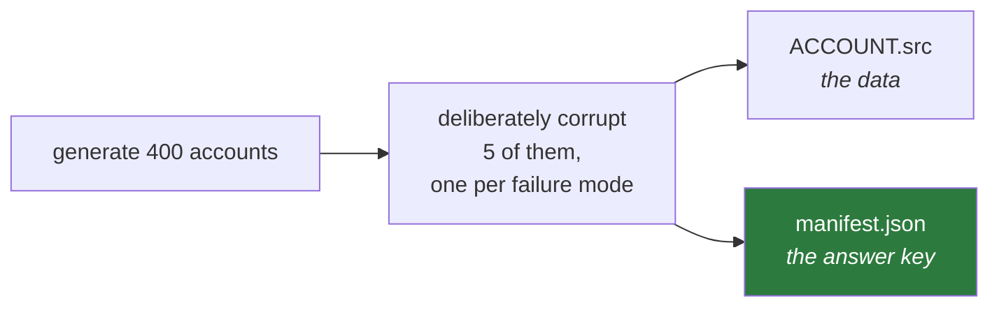
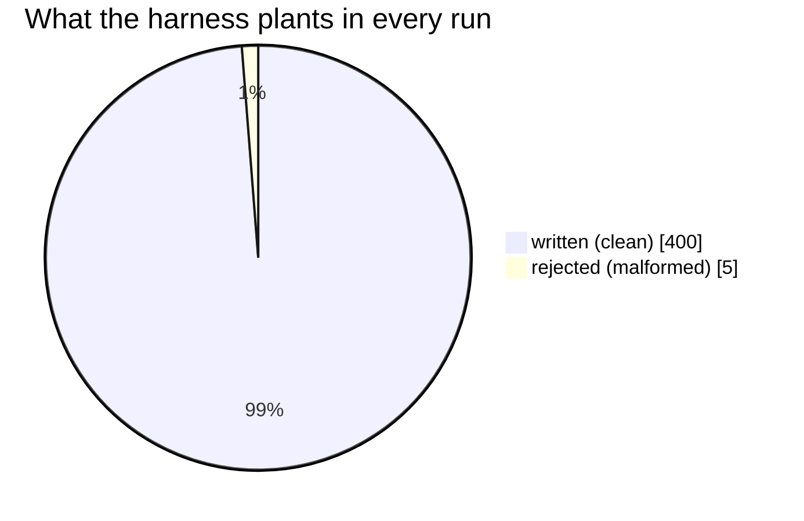

# `harness/` — the synthetic mainframe data generator

**In one sentence:** it invents the source data *and* writes down the exact answer in
advance, so the acceptance tests check against a known truth instead of whatever the
pipeline happened to produce.

> **Update 2026-08-21.** [`docs/PLAN-CHANGES-21082026.md`](../docs/PLAN-CHANGES-21082026.md)
> has landed: the harness seeds only written and rejected records — no excluded (CORP/PRIV)
> block, no duplicates — and the manifest feeds 8 acceptance criteria, not 10.
>
> **Update 2026-09-02.** `--format` is gone. The harness emits pipe-delimited CSV only —
> the fixed-width COBOL copybook layout was removed, following up on
> [`docs/PLAN-CHANGES-02092026-kafka-loader.md`](../docs/PLAN-CHANGES-02092026-kafka-loader.md).

```
harness/
└── generate.py     generates records + the manifest that says what should happen to them
```

## Why this is the most important small file in the repo

Most test data is generated, run through the system, and then the output is inspected to
see if it "looks right". That proves very little — a bug in the pipeline and a bug in the
expectation cancel out.

This harness works the other way round: it **seeds** defects deliberately and records what
each one must do.



`manifest.json` is written **before** the pipeline runs, and says exactly:

```json
{
  "total_records": 405,
  "expected_written": 400,
  "expected_rejected": 5,
  "expected_by_reason": { "PARSE_BAD_DATE": 1, "SCHEMA_INVALID": 1, ... }
}
```

The acceptance suite then asserts the live system against those numbers. Criterion 2
requires every seeded malformed record to be rejected with the **correct reason code** —
not just the right reject total.

## The 405 records



Those numbers are the balancing equation — `405 = 400 written + 5 rejected`. Seeding the
breakdown, not just the total, is the point: a record rejected for the wrong reason would
still balance. If a run produces any other split, something is wrong — and the acceptance
suite says which side gained or lost records.

## One record per failure mode

Each of the five rejects targets a *different* enumerated reason, so the reject taxonomy is
genuinely exercised rather than just totalled. `PARSE_INVALID_JSON` is gone — homogeneous
`.DAT` records (D6) carry no JSON side-channel to corrupt:

| Seeded defect | Must be rejected as |
|---|---|
| truncated line | `PARSE_SHORT_RECORD` |
| letters in a numeric field | `PARSE_BAD_NUMERIC` |
| impossible date | `PARSE_BAD_DATE` |
| status code not in the enum | `MAP_UNMAPPED_ENUM_VALUE` |
| violates the target schema | `SCHEMA_INVALID` |

A pipeline that rejected all five for the *wrong* reasons would still balance — and would
still fail the reason-code check, which examines the codes individually.

## Deterministic

Everything is driven by a seed:

```bash
python -m harness.generate --accounts 400 --seed 99
```

Same seed, same 405 records, same manifest, byte for byte. A failing run can be reproduced
exactly — including which specific account was corrupted and how.

## Used by

- `make run` — generates the input for the local end-to-end run
- `tests/test_engine.py` — the oracle for the in-memory engine tests
- `tests/acceptance.py` — the expected numbers for all 8 acceptance criteria

## Adding a new failure mode

1. Add the kind to `MALFORMED_KINDS`.
2. Implement the corruption in `_break()`.
3. Map it to its expected reason in `EXPECTED_REASON`.

The parametrised test `test_each_malformed_kind_produces_its_enumerated_reason` picks it up
automatically — if the engine cannot produce that reason, the new test fails immediately.
