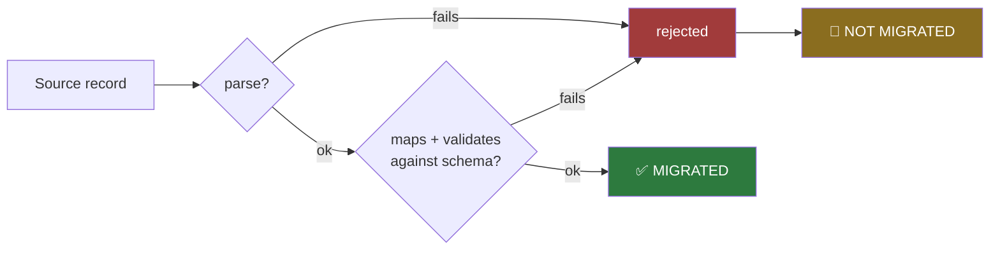
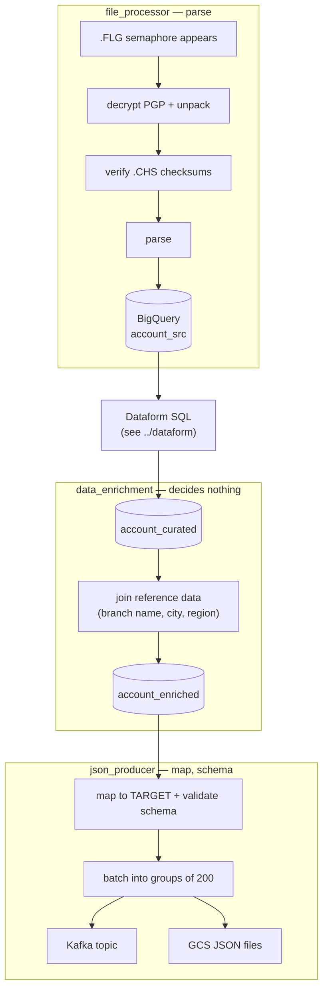
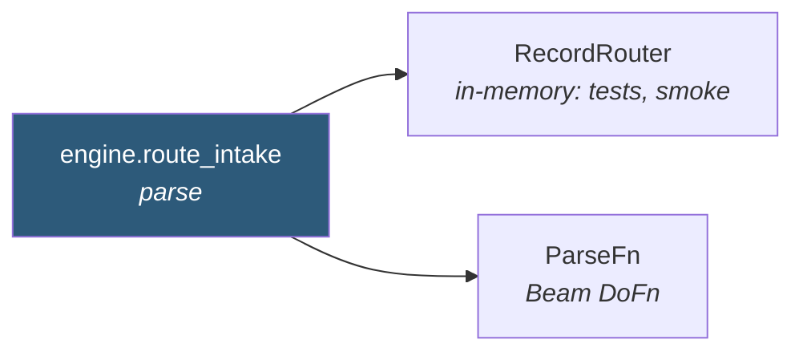

# `pipelines/` — the correctness engine and the three Beam pipelines

**In one sentence:** this is where every source record is turned into a Target System
document, and where the promise "every record leaves through exactly one door" is
actually enforced.

If you read only one folder in this repo, read this one. Everything else — Terraform,
Composer, the Java apps — exists to run what is in here.

> **Update 2026-08-21.** [`docs/PLAN-CHANGES-21082026.md`](../docs/PLAN-CHANGES-21082026.md)
> has landed: two dispositions (`WRITTEN / REJECTED`), stages `parse → map → schema` (no
> `filter(exclude)`, no `dedup`), one full snapshot per run (no initial/delta, no window),
> and 8 acceptance criteria.

## What's inside

```
pipelines/
├── common/              the engine — no Beam, no cloud, pure logic
│   ├── doors.py         the two doors + the balancing equation
│   ├── engine.py        routing a record through those doors
│   ├── tds.py           the record-layout parser (fixed-width or JSON)
│   ├── mapping.py       YAML-driven SRC → TARGET transformation
│   ├── schema.py        JSON Schema validation + BigQuery schema derivation
│   ├── config.py        one Backend + Runner, validated; and require_identifier
│   ├── artefacts.py     the cross-language contract, loaded from contracts/artefacts.json
│   ├── storage.py       GCS + BigQuery clients
│   ├── sinks.py         where output goes (Kafka / GCS)
│   ├── runner.py        DirectRunner vs DataflowRunner
│   └── pgp.py           decryption of the inbound bundle
├── file_processor/      pipeline 1 — parse
├── data_enrichment/     pipeline 2 — reference-data join, decides nothing
└── json_producer/       pipeline 3 — map, schema, batching, emit
```

`artefacts.py` is worth calling out: it reads `contracts/artefacts.json`, the same file
`apps/common`'s `Artefacts.java` loads from its classpath, so `.FLG`/`.CHS`/`.DAT` naming
and the shared BigQuery column names are declared once rather than once per language.

## The two doors — the central idea

Every record that enters the system leaves through **exactly one** of two doors:
**migrated** or **not migrated**. Nothing vanishes, nothing is counted twice.

A record that was not migrated always says *why* — its **disposition**. That is what makes
"why was this account not migrated?" answerable rather than merely countable.

And it is answerable per record, not just in aggregate: every not-migrated record is written
to **`bq_recon.record_lineage`** with its source key, door, stage and enumerated reason.
`run_ledger` holds the tallies; the register holds the records behind them, and
reconciliation fails the run if the two disagree. Acceptance criterion 6 checks it.



That gives one equation, checked on every run — and a run that does not balance **fails**:

```
SRC_read = written + rejected
```

There is one not-migrated disposition — `rejected` — so the breakdown *is* the equation, not
a pair of numbers layered under it. What is recorded underneath is the reject-reason split
(`PARSE_BAD_DATE`, `SCHEMA_INVALID`, …), one row per reason — and that is what the harness
oracle checks (criterion 2: every seeded malformed record rejected with the correct reason).

**Why the order still matters.** Parse comes before map/schema, so a malformed record is
rejected before it can be mapped. Each record gets one disposition, always — and getting
the total right is *not* sufficient, because a record rejected for the *wrong* reason still
balances. That is exactly what the harness oracle catches (criterion 2: the reason code,
not just the reject count).

## How the three pipelines split the decision

A record's disposition is not settled in one place — and that is deliberate, because the
data has to pass through SQL and an enrichment join in between. The two-door equation
therefore closes across the whole lane, not inside any single process.



**The key constraint:** `json_producer` cannot run earlier. Mapping needs `BRANCH_NAME`,
which only exists after `data_enrichment` adds it. Anyone "simplifying" the file processor
into settling every disposition at intake — running map and schema there too — will reject
100% of records, because `BRANCH_NAME` is missing at that point and every record fails
`MAP_MISSING_REQUIRED`. There is a test
(`test_route_intake_does_not_run_the_map_door`) that exists purely to stop that.

## What is shared, and what deliberately isn't



Parse has **one** implementation, called by both paths — a test runs the whole corpus
through both and asserts they agree. There is no dedup stage: the source snapshot is
assumed to contain no duplicate account keys, and replays are made idempotent by
count-then-DELETE per `run_id`, not by a dedup key.

## Local vs real GCP

The same code runs in both worlds. Four files hold every difference:

| File | Local | Real GCP |
|---|---|---|
| `config.py` | emulator endpoints | real project, ADC |
| `storage.py` | fake-gcs, BQ emulator | real GCS, real BigQuery |
| `runner.py` | `DirectRunner` | `DataflowRunner` |
| `sinks.py` | Redpanda; `InsertAllBigQueryWriter` | Managed Kafka; `FileLoadsBigQueryWriter` (NDJSON staged in GCS, then a load job) |

TDS files, mapping YAML, the door logic and the SQL are **identical** in both.

## Running one pipeline by hand

```bash
python -m pipelines.file_processor.pipeline --run-id my-run
python -m pipelines.data_enrichment.pipeline --run-id my-run
python -m pipelines.json_producer.pipeline  --run-id my-run --sinks both
```

Normally you would not: `make run` runs all seven stages in order.

## Where to look first

- **"How is a record rejected?"** → `common/doors.py` (the `Reason` enum is the taxonomy)
- **"How does a source line become fields?"** → `common/tds.py`
- **"How do I add a new target field?"** → `../contracts/mappings/*.yaml`, not code
- **"Why did the run fail?"** → search the log for `BalanceError`
