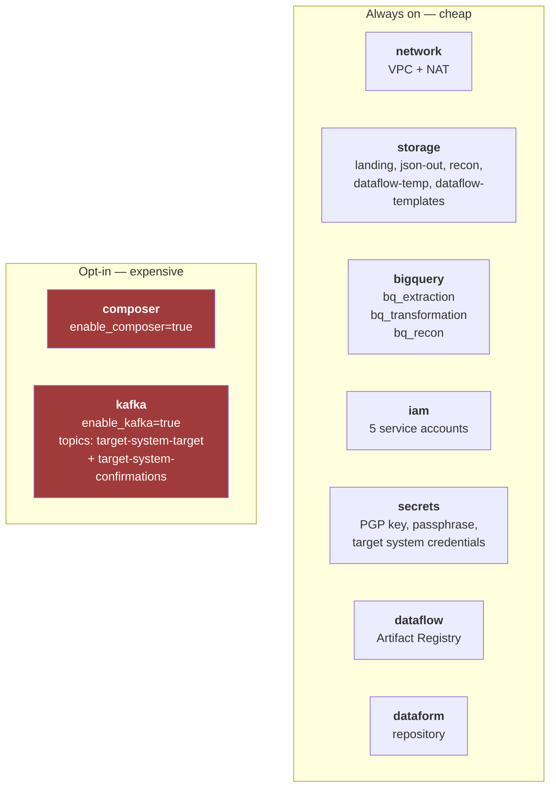
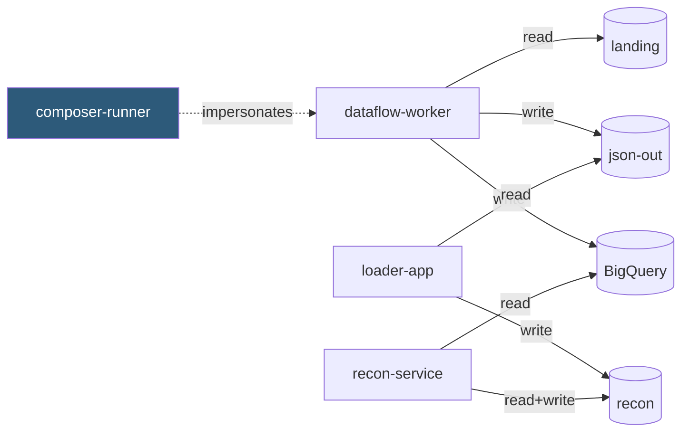

# `terraform/` — the real GCP infrastructure

**In one sentence:** everything the pipeline needs on Google Cloud, with the two expensive
things switched **off** by default.

```
terraform/
├── envs/dev/main.tf     the one file you configure — wires all modules together
└── modules/
    ├── bootstrap/       project + API enablement + the tfstate bucket
    ├── network/         VPC, subnet, Cloud NAT, firewall
    ├── storage/         5 GCS buckets
    ├── bigquery/        3 datasets + the run_ledger and reject_log tables
    ├── iam/             5 service accounts, least privilege
    ├── secrets/         Secret Manager entries
    ├── dataflow/        Artifact Registry for the pipeline images
    ├── dataform/        the Dataform repository
    ├── composer/        Cloud Composer  ⚠ ~$300-400/mo
    ├── composer_rbac/   GKE Role + RoleBinding + the mig-pipeline KSA the DAG's pods need
    └── kafka/           Managed Kafka   ⚠ billed per vCPU-hour (topics: target-system-target, target-system-confirmations)
```

`composer_rbac` is gated on `composer_pod_namespace`, which Composer does not expose as a
Terraform attribute — so it is a **second apply**, after reading the namespace off the live
cluster. Skip it and every pod task fails with `pods is forbidden`. See the two-phase apply
in the root README.

## What gets built



The `storage` module owns the five *flow* buckets. The sixth, `<project>-tfstate`, is
created by `bootstrap` — it has to exist before the backend that holds the state for
everything else.

**The cost gate is the important design decision here.** Composer bills from the moment
it is created — not from first DAG run — because the GKE cluster and Cloud SQL database
exist even when idle. So both live behind flags, and the runbook's teardown story is
`destroy -target` on exactly these two modules.

## Least privilege, drawn



The dotted line matters: project-level roles are **not** enough to launch a Dataflow job.
The DAG runs as `composer-runner` but the job must execute as `dataflow-worker`, so
`composer-runner` needs `serviceAccountTokenCreator` + `serviceAccountUser` *on that
service account* — a resource-level grant no project role can express. Without it every
Dataflow task fails at submission.

The reconciliation service can read everything and write nothing but its own reports.
That separation is what makes an audit tractable.

## Usage

```bash
export TF_VAR_project_id=my-project-dev
export TF_VAR_billing_account=XXXXXX-XXXXXX-XXXXXX
source local/scripts/gcp/_env.sh

terraform -chdir=terraform/envs/dev init
terraform -chdir=terraform/envs/dev plan      # always read this before applying
terraform -chdir=terraform/envs/dev apply

# Only when you actually need Composer (~20-40m to create):
terraform -chdir=terraform/envs/dev apply -var=enable_composer=true

# Turning the expensive parts off again — scoped on purpose:
terraform -chdir=terraform/envs/dev destroy -target=module.composer
terraform -chdir=terraform/envs/dev destroy -target=module.kafka
```

An unscoped `destroy` would take the buckets and datasets with it. Only Composer and
Kafka bill meaningfully while idle, so only they need removing.

## Things that will bite

- **`create_project` defaults to `false`.** The common case is deploying into a project
  that already exists. Creating one needs `billing.resourceAssociations.create` on the
  billing account, which an ordinary deployer service account does not have.
- **The backend bucket is hardcoded** at `envs/dev/main.tf` — a `backend` block cannot use
  variables. Change it when retargeting, or you will attach to the wrong state.
- **APIs enable asynchronously.** A first apply can fail on a service that is still
  activating; re-running usually resolves it.
- **Chicken-and-egg on state.** The tfstate bucket is itself Terraform-managed, so
  `bootstrap` applies with local state first, then state migrates into the bucket.
- **Don't Ctrl-C a Composer apply.** Terraform loses track of a half-created environment
  and you are left hand-deleting tenant resources.
- **`gcloud sql instances list` shows nothing** — Composer's database lives in a
  Google-managed tenant project. Not a stall.

## dev-only choices

`force_destroy` on buckets and `deletion_protection = false` on datasets are annotated in
the modules with why they must **not** survive into production. They exist so a dev
environment can be torn down in one command; in prod they would be the reason an accident
becomes unrecoverable.
