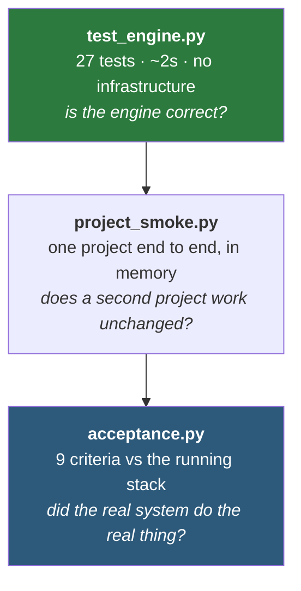
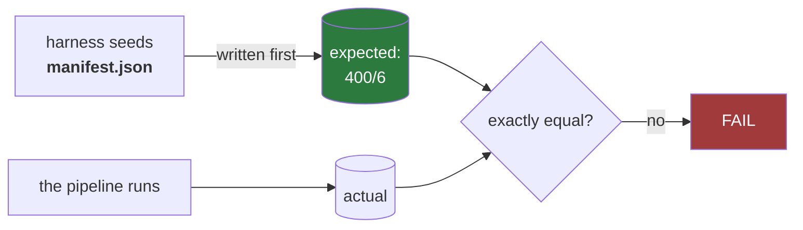

# `tests/` — three layers, from milliseconds to a full stack run

**In one sentence:** the acceptance criteria are executed, not described — and they check
against numbers that were decided *before* the pipeline ran.

```
tests/
├── test_engine.py      27 unit tests — no Beam, no cloud, ~2 seconds
├── project_smoke.py    runs a whole project in memory (used by verify-project2)
└── acceptance.py       the 9 acceptance criteria against the live stack
```

> **Update 2026-08-22.** [`docs/PLAN-CHANGES-22082026.md`](../docs/PLAN-CHANGES-22082026.md)
> added criterion 9 — every TARGET row is confirmed by Target System. Criteria 1–8 check
> internal invariants; criterion 9 is the only one that checks an *external* system's own
> claim. It is skipped (not failed) when the confirmation stream is not enabled, so a no-Kafka
> run stays green.

> **Update 2026-08-21.** [`docs/PLAN-CHANGES-21082026.md`](../docs/PLAN-CHANGES-21082026.md)
> has landed: 8 acceptance criteria (the excluded-exact and delta-run criteria are dropped),
> `405 = 400 written + 5 rejected`, and no dedup-survivor test.

## The three layers



```bash
make test              # unit tests (Python + Java)
make verify-project2   # the extend-not-rewrite proof
make run              # full end-to-end run
make verify            # the 9 acceptance criteria
```

## The 9 acceptance criteria

`acceptance.py` reads the **live** stack — BigQuery, GCS, Kafka — not a log file, and
exits non-zero on the first thing that is not true.

| # | Criterion |
|---|---|
| 1 | the balancing equation closes across the whole lane |
| 2 | every seeded malformed record rejected with the **correct reason code** |
| 3 | 100% of emitted documents validate against the JSON Schema |
| 4 | documents emitted in batches of exactly 200 |
| 5 | every account key appears exactly once in the target — no orphans |
| 6 | every not-migrated record is **named** in `record_lineage`, agreeing with the ledger |
| 7 | all five artefact types present in both lanes |
| 8 | `.CHS` checksums re-verify on both sides |
| 9 | every TARGET row is **confirmed by Target System** (the only criterion checking an *external* system's own claim) |

### How criterion 9 differs from 1–8

Criteria 1–8 are internal invariants — they check that *our* lane is internally consistent
(the equation closes, the rejects are named, the checksums verify). Criterion 9 is the only
one that checks an *external* system's own claim: that Target System actually persisted what
the Loader sent. The mock publishes one `{runId, accountId, accountKey, confirmedAt}` event
per accepted write (HTTP 201) to the `target-system-confirmations` topic; recon
set-differences those keys against `account_target` and fails the run on an unconfirmed row.
When the confirmation bootstrap is empty (no Kafka / `smoke-gcp --sinks gcs`) the criterion
is **skipped**, not failed — "not configured" must not read as "zero confirmations", or a
no-Kafka run could never go green. See [docs/PLAN-CHANGES-22082026.md](../docs/PLAN-CHANGES-22082026.md).

A passing run prints the equation itself, so the numbers are visible rather than implied:

```
✓ 1. balancing equation closes: 405 = 400 written + 5 rejected
```

## Why the oracle matters



The expectations are **seeded, not observed**. Checking output against itself proves
nothing; checking it against a manifest written before the run is what makes the
"exactly" meaningful.

## Tests that exist to stop specific mistakes

Some tests are less about "does it work" and more about "will someone break this later":

| Test | Prevents |
|---|---|
| `test_beam_intake_and_router_agree_on_every_record` | the two door implementations drifting apart |
| `test_beam_dofn_actually_delegates_to_the_shared_door` | someone re-inlining a second copy of the door logic that merely *agrees* |
| `test_route_intake_does_not_run_the_map_door` | "simplifying" the file processor into settling every disposition at intake — which would reject 100% of records, because `BRANCH_NAME` does not exist yet |
| `test_csv_layout_yields_identical_fields` | the layout switch quietly becoming code rather than config |
| `test_two_doors_partition_every_disposition` | a new disposition that does not map to a door — which would let `migrated + not_migrated` balance while the breakdown underneath it lied |

Each was verified by deliberately breaking the thing it guards and confirming it fails —
a test asserting "these two are wired together" is worthless until you have seen it go red.

## Local gotchas

- **A long-running Target System mock accumulates idempotency state.** `accepted=0
  duplicates=400` means it remembers a previous run — restart the container. This is the
  mock being correct.
- **The BigQuery emulator can degrade.** If recon queries start timing out at 180s,
  restart it; that has been mistaken for a code regression before.
- **`make verify` reads `local/state/last_run_id`** — it checks the *last* run, so run
  `make run` first or you will verify a stale one.
